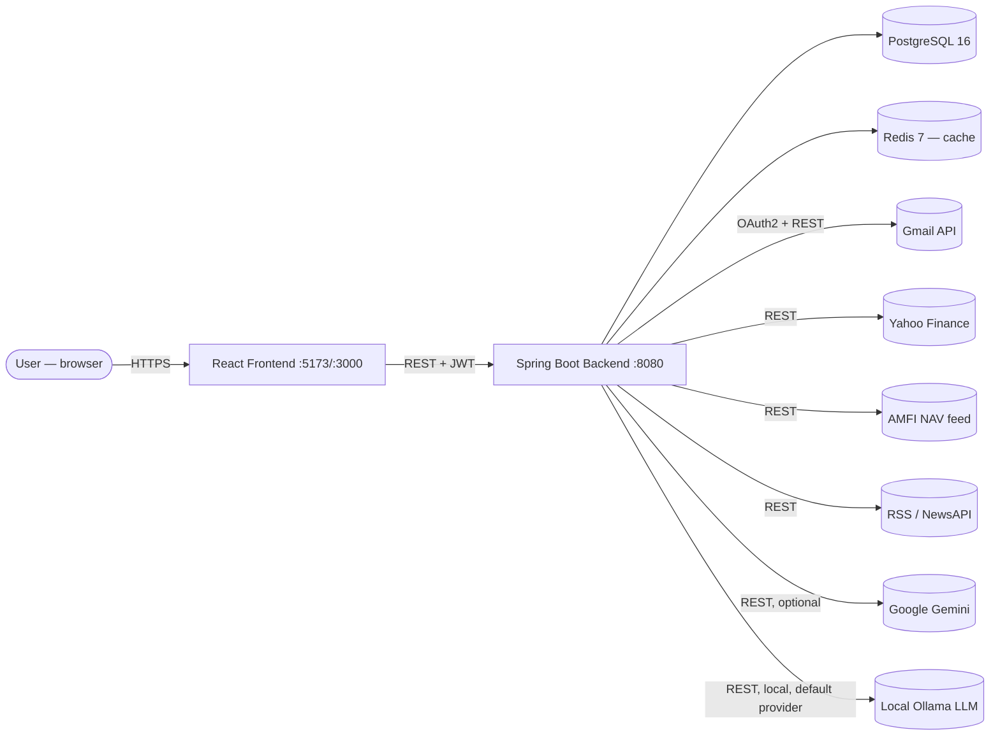
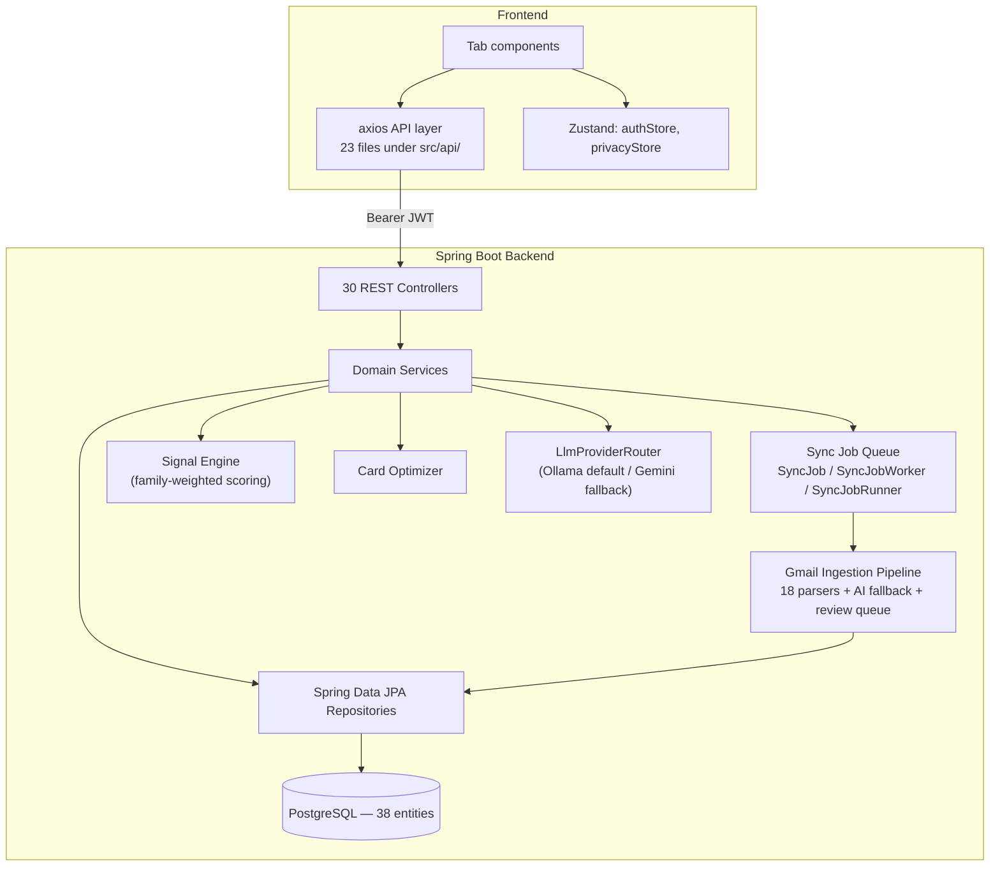

# Architecture Overview

## Stack

| Layer | Technology | Version (verified) |
|---|---|---|
| Backend runtime | Java | 25 (`pom.xml`: `java.version`/`maven.compiler.release=25`) |
| Backend framework | Spring Boot | 3.5.3 |
| ORM | Hibernate/JPA (jakarta namespace) | via Spring Boot 3.5.3 BOM |
| Database | PostgreSQL | 16 (`postgres:16-alpine` in `docker-compose.yml`) |
| Cache/queue substrate | Redis | 7 (`redis:7-alpine`) |
| Auth | JJWT | 0.12.6 |
| API docs | springdoc-openapi | 2.8.9 |
| Frontend | React | 19 |
| Build tool | Vite | 8 |
| Styling | Tailwind CSS | 3 (light-mode token palette) |
| Charts | Recharts | — |
| Client state | Zustand | 2 stores (`authStore`, `privacyStore`) |
| Server-state fetching | None — raw `useState`+`useEffect`+axios | `[PLANNED / NOT IMPLEMENTED]`: no React Query/SWR anywhere |
| Local AI | Ollama | `qwen2.5:7b` default, config-swappable to Gemini |

## System Context



## Component Architecture



## Layered pattern (per domain — see `ARCHITECTURE_DECISIONS.md` for deviations)

```
Controller  (@RestController, @AuthenticationPrincipal User for auth)
    ↓
Service     (@Service, @RequiredArgsConstructor, business logic)
    ↓
Repository  (JpaRepository<Entity, Long>, derived-name + @Query finders)
    ↓
Entity      (@Entity, Lombok @Data/@Builder, JPA annotations directly — no separate mapper layer)
```

30 controllers exist; not every domain has the full stack — `mf`, `forecast`, `recommendation`,
`reconciliation`, `analyst`, `amfi`, `reminder`, `tax`, `signal`, `technical` are read-only/derived
domains with no owned entity/repository. See `BACKEND_STRUCTURE.md` for the full per-domain map.

## Security model

- **Stateless JWT** (`SessionCreationPolicy.STATELESS`), `BCryptPasswordEncoder(12)`.
- `JwtAuthFilter` runs before `UsernamePasswordAuthenticationFilter` in the chain.
- Explicit `permitAll` paths: `/api/auth/**`, `/api/gmail/callback`, `/api/gmail/push` (protected
  instead by a query-string shared secret, since Google Pub/Sub can't carry a JWT), `/api-docs/**`,
  `/swagger-ui/**`, `/actuator/health`.
- Everything else: `anyRequest().authenticated()`.
- No method-level `@PreAuthorize`/`@Secured` usage anywhere — auth is enforced entirely by the
  path allowlist plus `@AuthenticationPrincipal User user` being a required controller argument.
- `/api/admin/**` → `hasRole("ADMIN")` is configured but **no controller maps under it**
  (`[PARTIALLY IMPLEMENTED]` — dead rule).

## Cross-cutting design principles (see `ARCHITECTURE_DECISIONS.md` for the "why")

1. **Ledger is the single source of truth** for holdings — never hand-set.
2. **One net-worth formula** (`PortfolioContextService`) consumed identically everywhere.
3. **Transfers are structurally net-worth-neutral** (equal-and-opposite balance mutation).
4. **A missing/uncertain input is `null` with a reason, never a guessed default.**
5. **Confidence is capped by data availability**, both in email classification (85% threshold)
   and signal scoring (`confidence = min(|composite|, ceiling)`).
6. **Idempotency by content, not by message ID** — a forwarded email with a new Gmail message ID
   still collides on the SHA-256 transaction fingerprint.
