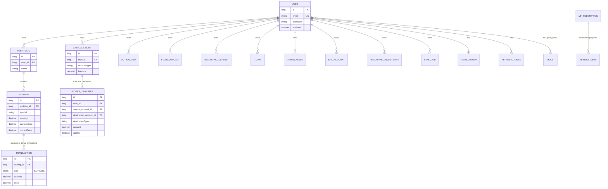

# Database Architecture

38 `@Entity` classes, PostgreSQL 16, Hibernate `ddl-auto=update` (dev) / `validate` (prod — schema
must be pre-migrated in prod, no auto-DDL).

## Entity-relationship diagram (core financial domain)

**Note on bare `userId` entities**: many entities below (see §"User FK pattern") use a plain
`Long userId` column with an index, but **no `@ManyToOne`/FK constraint** to `User`. These are
omitted from the ERD's relationship lines above for clarity but are documented in the table below.

## Full entity inventory by domain

### auth
| Entity | Table | Key columns | Relationships |
|---|---|---|---|
| `Role` | `roles` | `name` (unique, enum `RoleName{ROLE_USER,ROLE_ADMIN,ROLE_PREMIUM}`) | inverse of `User.roles` |
| `User` | `users` | `email` (unique), `password`, `enabled`, `emailVerified` | `@ManyToMany(EAGER)` → `Role` via `user_roles` join table |
| `RefreshToken` | `refresh_tokens` | `token` (unique, len 512), `expiresAt`, `revoked` | `@ManyToOne` → `User` (real FK) |

### portfolio
| Entity | Table | Key columns | Relationships |
|---|---|---|---|
| `Portfolio` | `portfolios` | `name`, `description` | `@ManyToOne` → `User`; `@OneToMany(cascade=ALL, orphanRemoval)` → `Holding` |
| `Holding` | `holdings` | unique `(portfolio_id, symbol)`; `quantity`(4dp), `averageCost`(2dp), `xirr` | `@ManyToOne` → `Portfolio`; `@OneToMany(cascade=ALL, orphanRemoval)` → `Transaction`. Transient: `getInvestedValue/getCurrentValue/getPnl/getPnlPercent` |
| `Transaction` | `transactions` | `type` (enum BUY/SELL), `quantity`, `price`, `charges` | `@ManyToOne` → `Holding` |

### market
| Entity | Table | Key columns |
|---|---|---|
| `Stock` | `stocks` | `symbol` (unique), OHLC + fundamentals (all nullable — Yahoo omits many), `active` |
| `PriceHistory` | `price_history` | `symbol`, `date`, `barStart`(intraday), `interval`(default "1d", column named `bar_interval` to dodge the PG reserved word), OHLC+volume |
| `MarketIndex` | `market_indices` | `symbol` (unique), value/change fields |

### mf
| Entity | Table | Key columns |
|---|---|---|
| `MfNavHistory` | `mf_nav_history` | unique `(scheme_code, date)`, `nav` (6dp — lossless vs. AMFI's 4-5dp) |

### gmail
| Entity | Table | Key columns | FK pattern |
|---|---|---|---|
| `GmailToken` | `gmail_tokens` | `accessToken`/`refreshToken` (2000-char, **plaintext**), `lastHistoryId`, `watchExpiration` | `@OneToOne` → `User` (real FK) |
| `ProcessedEmail` | `processed_emails` | unique `(user_id, gmail_message_id)`, `status` (IMPORTED/SKIPPED/FAILED) | bare `userId` |
| `ExcludedSender` | `excluded_senders` | unique `(user_id, pattern)` | bare `userId` |
| `PendingPdf` | `pending_pdfs` | unique `(user_id, gmail_message_id, attachment_id)`, `status`, `pipelineSteps` (JSON text) | bare `userId` |
| `SavedPdfPassword` | `saved_pdf_passwords` | unique `(user_id, provider_key)`, `encryptedPassword` (AES-GCM ciphertext, never returned to frontend) | bare `userId` |
| `ImportedTransactionFingerprint` | `imported_transaction_fingerprints` | unique `(user_id, fingerprint)` — SHA-256, 64 chars | bare `userId` |

### card
| Entity | Table | Key columns | FK pattern |
|---|---|---|---|
| `CreditCard` | `credit_cards` | `annualFee`, `pointsBalance`, `pointValue` | bare `userId`; `@ElementCollection` → `card_reward_rates` map (category→rate) |
| `CardRewardRule` | `card_reward_rules` | `cardName`, `category`, `rewardRate`, `monthlyCapAmount`, `effectiveFrom`/`effectiveTo`, `lastVerifiedAt` | none — global reference data. Methods: `isCurrentOn(date)`, `isStale(today, maxAgeDays)` |

### ledger
| Entity | Table | Key columns | FK pattern |
|---|---|---|---|
| `CashAccount` | `cash_accounts` | `accountType`, `balance` (authoritative — only changed via transfer or explicit correction) | `@ManyToOne` → `User` (real FK) |
| `LedgerTransfer` | `ledger_transfers` | `destinationType` (string, not FK — far side varies), `amount`, `applied` (guards double-apply) | `@ManyToOne` → `User`, optional `@ManyToOne` → `CashAccount` ×2 (source/destination) |

### actions
| Entity | Table | Key columns | FK pattern |
|---|---|---|---|
| `ActionItem` | `action_items` | unique `(user_id, action_type, symbol, action_date)`, `status` (enum `ActionStatus`) | `@ManyToOne` → `User` (real FK — code comment notes this follows the newer pattern, not the older bare-`userId` style) |

### ai / audit / review
| Entity | Table | Key columns | FK pattern |
|---|---|---|---|
| `AiHistory` | `ai_history` | `queryType` (enum), `prompt`/`response` (TEXT) | `@ManyToOne` → `User` (real FK, nullable) |
| `AiAuditTrail` | `ai_audit_trail` | `task`, `provider`, `model`, `confidence`, `status` (plain string, not enum), prompt/output columns declared `columnDefinition="text"` **deliberately not `@Lob`** (a `@Lob String` on Postgres becomes an orphan-prone `oid` large object) | bare `userId` |
| `EmailReviewItem` | `email_review_items` | unique `(user_id, gmail_message_id)`, `status` (enum `ReviewStatus`), `extractedFields` (raw JSON text) | bare `userId` |

### tracking
| Entity | Table | Key columns | FK pattern |
|---|---|---|---|
| `EpfAccount` | `epf_accounts` | `rate` (default 8.25 = EPFO FY2024-25) | `@ManyToOne` → `User` (real FK) |
| `FixedDeposit` | `fixed_deposits` | `status` (plain string: ACTIVE/CLOSED/MATURED_RENEWED), `renewedToId`/`renewedFromId` (bare Long self-refs, no FK) | `@ManyToOne` → `User` (real FK) |
| `RecurringDeposit` | `recurring_deposits` | `status` (ACTIVE/MATURED/CLOSED/MATURED_RENEWED), `tenureMonths`. Transient `getMaturityDate()` | `@ManyToOne` → `User` (real FK) |
| `Loan` | `loans` | `emi`, `outstanding`, `rate`, `remainingMonths` | `@ManyToOne` → `User` (real FK) |
| `OtherAsset` | `other_assets` | `category` (plain string: ppf/epf/nps/gold/realestate/...) | `@ManyToOne` → `User` (real FK) |

### redemption
| Entity | Table | Key columns | FK pattern |
|---|---|---|---|
| `MfRedemption` | `mf_redemptions` | `gainType` (STCG/LTCG), `status` (ACTIVE/COMPLETED, plain string). Method `getCashRemaining()` = redeemedAmount − reinvestedAmount, floored at 0 | bare `userId`; `@OneToMany(cascade=ALL, orphanRemoval)` → `Reinvestment` |
| `Reinvestment` | `reinvestments` | `amount`, `date`, `targetFund` | `@ManyToOne` → `MfRedemption` |

### scheduled
| Entity | Table | Key columns | FK pattern |
|---|---|---|---|
| `RecurringInvestment` | `recurring_investments` | `type` (enum SIP/PPF/NPS), `status` (plain string ACTIVE/PAUSED/COMPLETED) | `@ManyToOne` → `User` (real FK) |

### sync
| Entity | Table | Key columns | FK pattern |
|---|---|---|---|
| `SyncJob` | `sync_jobs` | `type`/`status`/`trigger` (all enums), `attempts`/`maxAttempts` (default 3), `claimedBy`/`claimedAt` (crash detection). Method `isTerminal()` | `@ManyToOne` → `User` (real FK) |

### expense / income
| Entity | Table | Key columns | FK pattern | Note |
|---|---|---|---|---|
| `Expense` | `expenses` | `category` — typed as `ExpenseCategory` enum **with no `@Enumerated` annotation** | bare `userId` | `[PARTIALLY IMPLEMENTED — modeling quirk]`: without `@Enumerated` or a registered `@Convert`, Hibernate's default mapping behavior for this field should be verified; it is not annotated as ordinal- or string-mapped at the field level |
| `Income` | `incomes` | `source` — typed as `IncomeSource` enum, persisted via `IncomeSourceConverter` (maps to display label, so legacy free-text rows read back unchanged) | bare `userId` | Correctly converter-backed, unlike `Expense.category` |

### goal / networth / news
| Entity | Table | Key columns | FK pattern |
|---|---|---|---|
| `FinancialGoal` | `financial_goals` | `targetAmount`, `currentSaved`, `expectedReturn` (default 10%) | bare `userId` |
| `NetWorthSnapshot` | `net_worth_snapshots` | unique `(user_id, snapshot_date)` | bare `userId` |
| `News` | `news` | `url` (unique), `sentiment` (enum POSITIVE/NEGATIVE/NEUTRAL) | none — global content |

## User FK pattern: real FK vs. bare `Long userId`

**Real `@ManyToOne`/`@OneToOne` + `@JoinColumn` to `User`:**
`RefreshToken`, `Portfolio`, `GmailToken` (`@OneToOne`), `CashAccount`, `LedgerTransfer`,
`ActionItem`, `AiHistory`, `EpfAccount`, `FixedDeposit`, `Loan`, `OtherAsset`, `RecurringDeposit`,
`RecurringInvestment`, `SyncJob`.

**Bare `Long userId` (no FK, no relationship object):**
`ProcessedEmail`, `ExcludedSender`, `PendingPdf`, `SavedPdfPassword`,
`ImportedTransactionFingerprint` (gmail), `CreditCard` (card), `Expense`, `Income`,
`MfRedemption`, `AiAuditTrail`, `EmailReviewItem`, `FinancialGoal`, `NetWorthSnapshot`.

This is a clean split by module age: newer/refactored modules (auth, portfolio, ledger, actions,
tracking, sync, ai/history) use real FKs; older modules (gmail, card, expense, income,
redemption, ai/audit, ai/review, goal, networth) still use bare longs.
`[PARTIALLY IMPLEMENTED — architectural inconsistency, not a bug: bare-userId tables still have
an index on the column, so query performance is unaffected, but referential integrity at the DB
level is not enforced for those tables.]`

## Every enum type in the codebase

| Enum | File | Values |
|---|---|---|
| `Role.RoleName` (nested) | `auth/entity/Role.java` | `ROLE_USER, ROLE_ADMIN, ROLE_PREMIUM` |
| `AiHistory.QueryType` (nested) | `ai/entity/AiHistory.java` | `STOCK_ANALYSIS, MARKET_SUMMARY, PORTFOLIO_REVIEW, FORECAST, CHAT` |
| `Transaction.TransactionType` (nested) | `portfolio/entity/Transaction.java` | `BUY, SELL` |
| `News.Sentiment` (nested) | `news/entity/News.java` | `POSITIVE, NEGATIVE, NEUTRAL` |
| `RecurringInvestment.Type` (nested) | `scheduled/entity/RecurringInvestment.java` | `SIP, PPF, NPS` |
| `ActionStatus` | `actions/entity/ActionStatus.java` | `PENDING, EXECUTED, SKIPPED, SNOOZED` |
| `ReviewStatus` | `ai/review/entity/ReviewStatus.java` | `PENDING, ACCEPTED, EDITED, REJECTED` |
| `SyncJobStatus` | `sync/entity/SyncJobStatus.java` | `QUEUED, RUNNING, SUCCEEDED, FAILED, CANCELLED` |
| `SyncJobType` | `sync/entity/SyncJobType.java` | `GMAIL_FULL_SYNC, GMAIL_INCREMENTAL_SYNC, GMAIL_RETRY_FAILED` |
| `SyncTrigger` | `sync/entity/SyncTrigger.java` | `MANUAL, SCHEDULED, PUSH, RECOVERY` |
| `ExpenseCategory` | `expense/entity/ExpenseCategory.java` | `FOOD, SHOPPING, TRAVEL, FUEL, BILLS, MEDICAL, ENTERTAINMENT, EMI, UPI, INVESTMENT, UNCATEGORIZED` |
| `IncomeSource` | `income/entity/IncomeSource.java` | `SALARY, BONUS, FREELANCE, BUSINESS, DIVIDEND, INTEREST, CAPITAL_GAIN, RENTAL, OTHER` |
| `EmailIntelType` | `ai/intel/EmailIntelType.java` | 26 values (see `02-backend/GMAIL_INGESTION_PIPELINE.md` §6) — not persisted, in-memory classification result only |

**Not real enums** (plain `String` columns with comment-documented allowed values):
`MfRedemption.status`, `RecurringInvestment.status`, `FixedDeposit.status`,
`RecurringDeposit.status`, `PendingPdf.status`, `AiAuditTrail.status`.

## Lifecycle callbacks (`@PrePersist`/`@PreUpdate`)

| Entity | Callback | Effect |
|---|---|---|
| `ActionItem`, `GmailToken`, `CashAccount` | both `onCreate`+`onUpdate` | timestamps set/refreshed |
| `AiAuditTrail`, `EmailReviewItem`, `ImportedTransactionFingerprint`, `ProcessedEmail`, `LedgerTransfer`, `CardRewardRule`, `SyncJob` | `onCreate` only | `createdAt` set if null |
| `User`, `Portfolio`, `OtherAsset` | `onUpdate` only | `updatedAt` refreshed |

All other entities rely on `@Builder.Default = LocalDateTime.now()` at construction — no
lifecycle callback.

## Indexing summary

Every multi-tenant table indexes on `user_id` (or `(user_id, status)`/`(user_id, date)`
composites) regardless of whether the FK is real or bare. Unique constraints exist specifically
to enforce idempotency: `(user_id, gmail_message_id)` on 3 gmail tables, `(user_id, fingerprint)`
on the fingerprint table, `(portfolio_id, symbol)` on `Holding`, `(user_id, action_type, symbol,
action_date)` on `ActionItem`.
