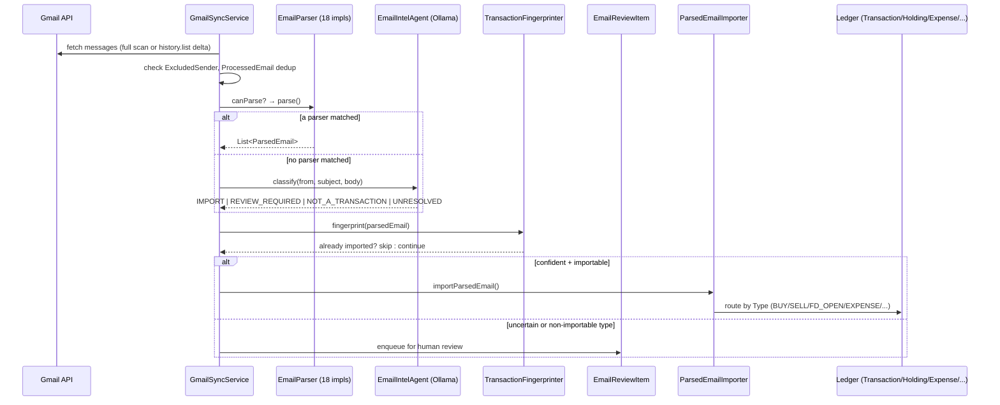
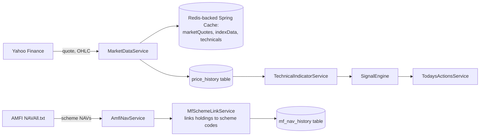

# Data Flow & External Integrations

## Integration inventory

| Integration | Purpose | Auth | Trigger | Status |
|---|---|---|---|---|
| Gmail API | Email discovery, OAuth, push watch | OAuth2 (offline access, refresh token) | Manual sync, 30-min scheduled poll, Gmail push (optional) | `[IMPLEMENTED]` |
| Yahoo Finance (`query1.finance.yahoo.com`) | Quotes, historical OHLC, index data | None (public endpoints) | On-demand + scheduled cache refresh (15 min) + daily sector-history refresh (18:30 IST weekdays) | `[IMPLEMENTED]` |
| AMFI (`portal.amfiindia.com` — see note) | Mutual fund NAV | None | Daily at 21:30 (`AmfiNavService.refresh`) | `[IMPLEMENTED]` |
| RSS feeds (Google News, Economic Times, Moneycontrol ×2, LiveMint, Business Standard) | Free news source, dev default | None | Every 30 min (`app.news.refresh-rate-ms`) | `[IMPLEMENTED]` |
| NewsAPI (`newsapi.org`) | Prod news source | API key | Same 30-min cycle, prod profile only | `[IMPLEMENTED]` (prod-only; dev uses RSS) |
| Google Gemini | AI narrative, portfolio review, chat, optional email classification | API key | On-demand | `[IMPLEMENTED]` |
| Ollama (local) | Default LLM provider — email classification, ambiguity resolution | None (local) | On-demand | `[IMPLEMENTED]` — default `qwen2.5:7b` at `localhost:11434` |
| Google Cloud Pub/Sub | Gmail push notification transport | Shared-secret query token | Real-time (if enabled) | `[IMPLEMENTED]`, disabled by default (`app.gmail.push.enabled=false`) |

**Note on AMFI URL**: `AmfiNavService` fetches from `portal.amfiindia.com`, not
`www.amfiindia.com` — the `www` host 302-redirects, and WebClient does not follow redirects by
default, so the code fetches the canonical redirect target directly (with redirect-following
explicitly enabled as a defensive measure).

## Data flow — Gmail ingestion → ledger (high-level; see `05-flows/GMAIL_TO_PORTFOLIO_FLOW.md` for the full trace)

## Market data flow

## AI provider routing

`LlmProviderRouter` selects between providers based on `app.llm.provider`:

| Value | Provider | Notes |
|---|---|---|
| `ollama` (default) | Local Ollama, `qwen2.5:7b` | No API cost, `temperature=0.0` for reproducible classification |
| `gemini` | Google Gemini | Requires `GEMINI_API_KEY` |
| `none` | Disabled | All AI-dependent paths (email classification fallback) are skipped; deterministic parsers still work |

`app.llm.fallback-enabled=true` allows falling back between providers if the primary fails
(exact fallback behavior: see `02-backend/BACKEND_STRUCTURE.md` `ai/llm` package).

## Caching

Spring Cache (`spring.cache.type=simple` — in-memory, not Redis-backed despite Redis being
provisioned) covers `marketQuotes`, `indexData`, `technicals` — evicted every 15 minutes by
`MarketDataService.refreshMarketData()` (`@CacheEvict(allEntries=true)`, a pure cache-bust with
no fetch of its own). Redis itself (`spring-boot-starter-data-redis`) is a live dependency but its
concrete usage beyond the `spring.cache.type=simple` default was not verified beyond connection
config — `[PARTIALLY IMPLEMENTED — Redis is provisioned but Spring Cache is configured to use the
in-memory `simple` provider, not Redis, in the profiles inspected]`.
