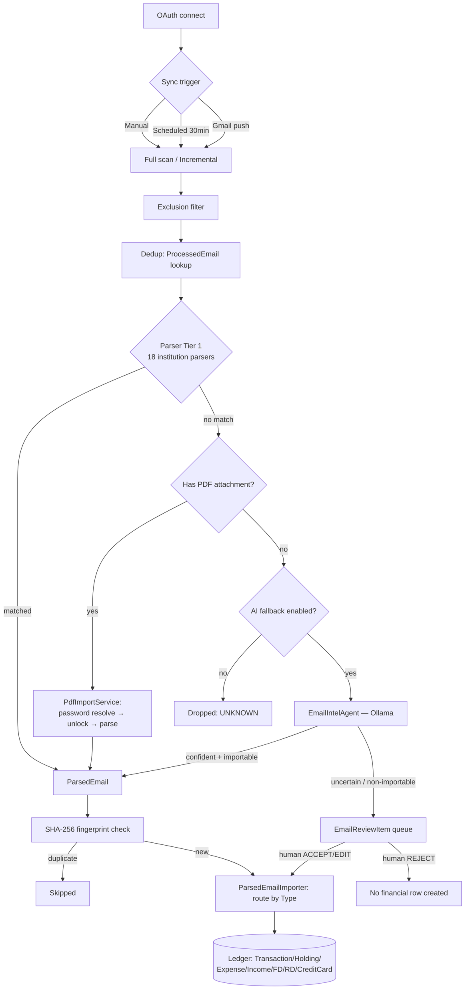

# Gmail Ingestion Pipeline — Deep Dive

All paths relative to `backend/src/main/java/com/marketai/`. This is the most complex subsystem
in the backend — read this fully before modifying anything in `gmail/`, `sync/`, or `ai/intel/`.

## Pipeline overview



## 1. OAuth / Auth — `gmail/service/GmailClientService.java`

- Config (`:41-48`) loads `clientId`/`clientSecret`/`redirectUri` via `@Value`, with a
  `@PostConstruct loadFromEnvFileIfMissing()` (`:53-72`) fallback reading a gitignored
  `gmail.env` file so credentials survive restarts without re-exporting env vars.
- `getAuthorizationUrl(userId)` (`:89-97`) — scope `GmailScopes.GMAIL_READONLY`,
  `accessType=offline`, `prompt=consent` (forces a refresh token every time, `:95`). `state` is
  signed as `"<userId>.<hmacSha256(userId)>"` (`:116-126`), HMAC key = OAuth client secret.
- Callback (`GmailController.callback`, `:72-114`): verifies state, exchanges code, fetches
  connected email, **upserts** `GmailToken` by userId — refresh token only overwritten if Google
  returned a new one (`:95`), preserving the original across re-consents that omit it.
- **Token refresh callback**: `buildGmailService(accessToken, refreshToken, TokenRefreshCallback)`
  (`:143-176`) attaches a `CredentialRefreshListener` so a mid-call silent token refresh is
  persisted immediately via the caller's callback — every caller (`GmailSyncService`,
  `SyncJobRunner`, `GmailWatchService`) wires this straight to `tokenRepo.save(token)`.
- `GmailToken.accessToken`/`refreshToken` are stored **plaintext** (2000-char columns) — no
  encryption at rest, unlike `SavedPdfPassword` which is AES-GCM encrypted.
- Disconnect (`:316-320`) deletes the `GmailToken` row only — no explicit Google-side revocation
  call is made.

## 2. Email discovery

### Full-scan path — `GmailSyncService.doSyncForUser` (`gmail/service/GmailSyncService.java`)

- Guarded by a **per-user `ReentrantLock`** (`:38, 74-83`) — concurrent syncs for one user are
  refused outright, not queued.
- Query built in `GmailClientService.fetchRecentMessages` (`:187-217`):
  ```
  "newer_than:" + lookbackPeriod + " (category:primary OR category:updates OR category:promotions OR category:social)"
  ```
  Paginated up to 20 pages, each message hydrated with `.setFormat("full")`.
- **Exclusion filter runs before any parser**: `ExcludedSenderRepository` patterns checked against
  `from+subject+body` (`:164-167, 205-215`). Matched emails are marked `EXCLUDED`/`SKIPPED` and
  never reach parsers, PDF queueing, or the AI fallback.
- Per-message dedup by Gmail message ID via `ProcessedEmail` lookup (`:172-186`) — a prior
  non-FAILED row is skipped; a prior FAILED row is retried.

### Incremental path — `GmailIncrementalSyncService`

- `fetchDelta(gmail, startHistoryId)` calls `users.history.list` filtered to `messageAdded` only,
  paginating up to `MAX_PAGES=50`.
- **Watermark rules** (documented in the class javadoc — do not weaken these):
  - No stored `startHistoryId` → forces a full sync.
  - HTTP 404 (historyId aged out of Gmail's retention window) → forces a full sync.
  - Any other `history.list` failure → watermark left untouched, not advanced.
  - Page-limit hit mid-drain → watermark untouched, remainder picked up next run.
  - Empty result set → watermark left as-is (Gmail's index can lag a push notification).
  - `advanceWatermark(current, candidate)` — pure `BigInteger` comparison, only ever moves
    forward.
- Consumed by `SyncJobRunner.runIncremental` — falls back to `runFull(userId, "14d")` whenever
  `!delta.isUsable()`. Fetches only the exact new message IDs (`syncSpecificMessages`), never a
  re-scan. The watermark is persisted **only when the delta was fully drained**.
- `runFull` captures the mailbox's *current* historyId **before** scanning, so anything arriving
  mid-scan is caught by the next incremental run rather than falling in a gap.

### Job-queue layer — `sync/` package (see `JOBS_AND_SCHEDULERS.md` for the worker mechanics)

- `SyncJob` entity: `type` (`GMAIL_FULL_SYNC`/`GMAIL_INCREMENTAL_SYNC`/`GMAIL_RETRY_FAILED`),
  `status` (`QUEUED`/`RUNNING`/`SUCCEEDED`/`FAILED`/`CANCELLED`), `trigger`
  (`MANUAL`/`SCHEDULED`/`PUSH`/`RECOVERY`), `attempts`/`maxAttempts` (default 3).
- `SyncJobService.enqueue()` collapses duplicates — an existing `QUEUED`/`RUNNING` job of the same
  type for that user is reused rather than a new one inserted (critical for push bursts).
- `SyncJobRunner.run(jobId)` dispatches `GMAIL_INCREMENTAL_SYNC` → `runIncremental`;
  `GMAIL_FULL_SYNC`/`GMAIL_RETRY_FAILED` → `runFull`.
- The old inline `POST /api/gmail/sync` (`GmailController.triggerSync`) still exists and still
  runs synchronously — kept for compatibility. The async path is `POST /api/sync/gmail`.

## 3. Push notifications

- `GmailWatchService.registerWatch(userId)` — calls `users().watch("me", ...)` with
  `topicName`/`labelIds=[INBOX]`; stores `expiration` on `GmailToken.watchExpiration`. Seeds
  `lastHistoryId` **only if none exists yet** — never rewinds an existing watermark.
- `renewAllDueWatches()` renews anything missing or expiring within `RENEW_WHEN_DAYS_LEFT=3` days.
  Scheduled daily (`GmailSyncScheduler.renewWatches`, `fixedDelay=86_400_000`).
- Push is explicitly "latency optimisation only" (class javadoc) — the 30-minute scheduled poll
  is never disabled, because Gmail caps push at 1 notification/sec/user and silently drops the
  rest.
- `GmailPushController` (`POST /api/gmail/push?token=...`): shared-secret query param checked
  against `app.gmail.push.verification-token`. **Always returns 200**, even on a bad token or any
  internal error, to avoid a Pub/Sub retry storm on a call that can never succeed. Decodes the
  base64 Pub/Sub payload → `emailAddress` → matches to a `GmailToken` by `connectedEmail` →
  enqueues a `GMAIL_INCREMENTAL_SYNC` job (duplicate-collapsed by `SyncJobService.enqueue`).
  **The notification's own historyId is never used as the watermark** — the runner always
  re-derives it from `history.list`.
- Disabled by default: `app.gmail.push.enabled=false`.

## 4. Parser Tier 1 (deterministic) — `gmail/parser/`

Interface:
```java
public interface EmailParser {
    boolean canParse(String from, String subject);
    List<ParsedEmail> parse(String from, String subject, String bodyText);
}
```

Spring injects `List<EmailParser> parsers`, ordered by `@Order`. **All parsers are `@Order(1)`
except `BankTransactionParser`, which is `@Order(100)`** — the generic catch-all, must run last.
`GmailSyncService` iterates in order and stops at the first parser whose `canParse` is true and
`parse` returns non-empty.

| Parser | Institution |
|---|---|
| `AngelOneParser` | Angel One/Angel Broking |
| `AxisBankParser` | Axis Bank (FD/RD only) |
| `BankTransactionParser` | **Generic bank alert catch-all** (`@Order(100)`) |
| `CamsParser` | CAMS RTA (MF SIP/purchase/redemption) |
| `CardBillParser` | Card issuers (statement/bill/amount due) |
| `DividendParser` | RTAs (LinkInTime/KFintech/CAMS/NSDL/CDSL) + all brokers |
| `GrowwParser` | Groww |
| `HdfcBankParser` | HDFC Bank (FD/RD only) |
| `IciciBankParser` | ICICI Bank (FD/RD/deposit) |
| `IciciDirectParser` | ICICI Direct (broker) |
| `IdfcBankParser` | IDFC First Bank (FD/RD) |
| `KfintechParser` | KFintech/Karvy RTA |
| `KotakParser` | Kotak Securities |
| `MstockParser` | mStock / Mirae Asset |
| `SbiBankParser` | SBI (FD/RD/deposit) |
| `UpiAppParser` | Paytm/PhonePe/GPay |
| `UpstoxParser` | Upstox |
| `YesBankParser` | Yes Bank (FD/RD) |
| `ZerodhaParser` | Zerodha/Kite |

Supporting: `ParsedEmail.java` (DTO; `Type` enum: `TRADE_BUY, TRADE_SELL, FD_OPEN, RD_OPEN, MF_SIP,
MF_REDEEM, DIVIDEND, INCOME, EXPENSE, CARD_BILL, UNKNOWN`), `ParserUtil` (shared string matching),
`ContractNoteHelper` (shared PDF contract-note row parsing), `SpendCategorizer` (expense
categorization helper).

## 5. PDF / attachment handling

- Discovery: `GmailClientService.findPdfAttachments` walks the MIME tree; bytes are **not**
  downloaded at sync time, only the reference (`PdfAttachmentRef`) — `downloadAttachment` is
  on-demand.
- Queueing: looked up by `(userId, gmailMessageId, filename)` — filename, **not** attachmentId,
  because Gmail can return a different attachment ID for the same physical file on refetch. New
  refs become a `PendingPdf` row; `tryAutoUnlock` is attempted immediately.
- `PendingPdf` status lifecycle: `NEEDS_PASSWORD → PASSWORD_FAILED / FAILED / IMPORTED /
  DISMISSED`. Stores `pipelineSteps` as a JSON trace (`email_detected`, `attachment_detected`,
  `password_found`, `pdf_downloaded`, `pdf_unlocked`, `trades_extracted`, `holdings_updated`,
  `dashboard_updated`) for the Contract Note Debug View.
- **Password resolution** (`PdfImportService.tryAutoUnlock`), three tiers in order:
  1. Exact match: `SavedPdfPassword` for this PDF's `providerKey`.
  2. Cross-provider PAN candidates: if the provider is in the hardcoded `PAN_PASSWORD_DOMAINS` set
     (25+ Indian brokers/RTAs/AMCs using PAN-uppercase convention), tries all saved passwords
     whose *own* provider is also in that set — handles multi-account households.
  3. Hint-based sharing: if `passwordHint` mentions "pan", falls back to any saved password whose
     hint also mentions "pan".
  - On success, saves a copy of the password under the *new* provider key too, so future
    statements from that provider unlock automatically.
- `SavedPdfPassword.encryptedPassword` — AES-256/GCM via `gmail/security/PasswordCipher.java`, key
  from `app.security.pdf-password-key` (random/ephemeral if unset).
- `PasswordHintExtractor` — regex priority order: PAN-first-4+DOB → PAN+DOB → PAN-only →
  Customer ID → Folio → DOB-only; falls back to a hardcoded `KNOWN_PROVIDER_DEFAULTS` map
  (CAMS/mStock/NSE/KFintech → "PAN uppercase") when the email gives no explicit instruction.
- PDFBox 3.x: `Loader.loadPDF(bytes, password)` throws `InvalidPasswordException` on a wrong
  password. On success, `PDFTextStripper().getText(doc)` extracted text runs through the **same
  parser chain**, then a direct `ContractNoteHelper` fallback, then the AI extractor as last
  resort.

## 6. Tier 2 AI fallback — `ai/intel/EmailIntelAgent.java`

- Triggered only when `parsed.isEmpty()` after all regex parsers, gated by
  `app.gmail.ai-fallback.enabled` (default true) and `emailIntelAgent.isEnabled()`.
- **Pre-filter**: `looksFinancial()` checks a `MONEY_SIGNALS` keyword list before ever calling the
  LLM — non-financial mail short-circuits at zero model cost.
- **Prompt** (`SYSTEM_INSTRUCTION`): fixed enum of 30 classification labels, a `confidence` (0-1),
  `extractedFields` (amount/date/merchant/symbol/quantity/price/units/nav/folio/fundName/bank/
  cardLast4/paymentMethod/counterparty), `reasoning`, and `evidence` (the literal source
  sentence). Explicit prompt rules: never invent values (use null), use `INTERNAL_TRANSFER`/
  `SELF_TRANSFER` for self-account movements (never an expense), give the exact NSE ticker, lower
  confidence on ambiguous/forwarded mail.
- Body truncated to `MAX_BODY_CHARS=6000`; routed through `LlmProviderRouter.complete()`, parsed
  via `LlmJsonParser` (strict readers — never silently coerce a malformed value).
- **`EmailIntelType`** — 26 semantic labels mapped to a coarser `ParsedEmail.Type` via
  `importAs()`. Several map to `null` on purpose (`MF_SWITCH`, `FD_MATURITY`, `RD_INSTALLMENT`,
  `INTERNAL_TRANSFER`, `SELF_TRANSFER`, `OTP_OR_ALERT`, `PROMOTIONAL`, `STATEMENT_ONLY`,
  `UNKNOWN`) — these can **never** be auto-imported (`isImportable()` is false).
- **Confidence threshold**: `app.llm.min-confidence` default **0.85**. `confidence == null` is
  treated identically to below-threshold — absence of a score is never permission to import.
  Below threshold **or** a non-importable type → `REVIEW_REQUIRED`.
- **Field requirements per type** (enforced in `toParsedEmail`): trades need
  `symbol+price+quantity` all non-null; MF SIP/redeem need `amount`; FD needs `principal`; RD
  needs `amount`; everything else needs `amount`. A confident classification that still fails
  these checks routes to review rather than importing partial data.
- **Deterministic-safety guardrail — symbol resolution**: `resolveSymbol(candidate)` only accepts
  an **exact** match or the **sole** search hit from `MarketDataService.searchStocks`. An
  ambiguous/unrecognized ticker is refused (forces the trade to review) rather than risking a
  mis-attributed holding.
- Every classification (accepted, reviewed, or unparseable) is recorded via `AiAuditService` for
  the audit trail (`task=EMAIL_CLASSIFY`).

## 7. Review queue — `ai/review/`

- `EmailReviewItem` — one row per `(user_id, gmail_message_id)`, storing `proposedType`,
  `confidence`, `reviewReason`, `reasoning`, `evidence`, `extractedFields` (raw JSON), and status
  (`PENDING`/`ACCEPTED`/`EDITED`/`REJECTED`).
- Routing: `EmailIntelAgent`'s `IMPORT` outcome goes straight to `ParsedEmailImporter`;
  `REVIEW_REQUIRED`/`UNRESOLVED` calls `emailReviewService.enqueue()` and the email is marked
  `SKIPPED` (type `REVIEW_REQUIRED`) in `ProcessedEmail` — **not** imported.
- `enqueue()` is idempotent — a resolved item is never resurrected; headline fields are taken
  only from the already-validated `result.getParsed()` payload, never re-derived from raw model
  text.
- **Decision flow** (`POST /api/review/{id}/decision`):
  - `REJECT` → status `REJECTED`, no import.
  - `ACCEPT` → imports using the stored proposed fields as-is.
  - `EDIT` → imports using request-supplied corrected fields, falling back to stored values.
  - `importDecided` rejects non-importable types silently as "a judgement, no financial row
    created" — protects against e.g. accepting an `INTERNAL_TRANSFER` as a spend. Requires a
    non-null amount or throws 400.
  - An accepted/edited review item still passes the SHA-256 fingerprint gate exactly like a
    normal import (§8) — the review queue is not a fingerprint-gate bypass.

## 8. Deduplication / idempotency — `ParsedEmailImporter.java`

Two independent layers:

1. **SHA-256 fingerprint gate** (primary): `TransactionFingerprinter.fingerprint(pe)` hashes
   `type | date | amount | price | principal | monthlyAmount | units | quantity | symbol | folio
   | fundName | bank | merchant | cardLast4` — **deliberately excludes** Gmail message ID, sender,
   and free-text description, so a forwarded/resent copy still collides. Checked via
   `fingerprintRepo.existsByUserIdAndFingerprint` before any table-specific routing. A new
   `ImportedTransactionFingerprint` row is saved only on a **successful** import — a failed
   import stays retryable.
2. **Per-domain content checks** (defense-in-depth): `isDuplicateExpense` (sourceEmailId OR
   amount+date+merchant match), `isDuplicateIncome` (similar, plus a dividend-specific rule), FD
   (`bank+principal+startDate`), RD (`bank+monthlyAmount+startDate`), trades/MF
   (`portfolioService.isDuplicateTrade` — requires an existing holding, checks
   `symbol+date+quantity+price`).
- `CARD_BILL` has no dedup beyond the fingerprint gate — it's an overwrite-style update
  (`currentDue`/`currentDueDate`), naturally idempotent by design.
- `POST /api/gmail/resync` wipes both `ProcessedEmail` and `ImportedTransactionFingerprint` for
  the user, so a full resync can re-import anything manually deleted — subsequent re-import is
  then gated purely on whether the domain record still exists (per-domain checks above).

## 9. Ledger commit — `ParsedEmailImporter.routeImport`

| `ParsedEmail.Type` | What gets written |
|---|---|
| `TRADE_BUY` | `portfolioService.addHolding(...)` on the user's first portfolio (auto-created if none) — creates/updates `Holding` + `Transaction` |
| `TRADE_SELL` | If a matching `Holding` exists: `sellHolding(...)`. If not: booked as `Income` with `IncomeSource.CAPITAL_GAIN` instead (no holding to sell against) |
| `MF_SIP`/`MF_REDEEM` | Also `addHolding`, synthetic `.MF`-suffixed symbol from the fund name. Rejected outright if `FinancialDataValidator.looksLikeUnverifiableFundName` flags the name as boilerplate |
| `FD_OPEN` | `trackingService.addFd(...)` then `detectAndLinkRenewal` — every FD_OPEN is checked for a renewal match |
| `RD_OPEN` | `trackingService.addRd(...)` then `detectAndLinkRdRenewal` |
| `DIVIDEND` | `Income` with `IncomeSource.DIVIDEND`, `payer=symbol` |
| `INCOME` | `Income` with `IncomeSource.fromLabel(...)` |
| `EXPENSE` | `Expense` with `ExpenseCategory.fromLabel(...)` |
| `CARD_BILL` | Looks up `CreditCard` by last-4 then issuer name; **updates** `currentDue`/`currentDueDate` — no new record if no card on file |
| `UNKNOWN` / default | No-op — silently dropped (should be unreachable, since both parsers and the review queue gate on importable types upstream) |

---

## Developer guide: adding a new bank/broker parser

1. **Implement `EmailParser`** in a new class under `gmail/parser/`:
   ```java
   @Component
   @Order(1)   // specific-institution parsers use 1; only BankTransactionParser uses 100 (catch-all, must run last)
   public class NewBrokerParser implements EmailParser {
       @Override
       public boolean canParse(String from, String subject) { ... }
       @Override
       public List<ParsedEmail> parse(String from, String subject, String bodyText) { ... }
   }
   ```
2. **Registration is automatic** — Spring component-scans the `@Component` and injects it into the
   `List<EmailParser>` wherever it's a constructor dependency. No manual registry.
3. **Naming**: `<Institution>Parser.java`, matching the existing set.
4. **`canParse` convention**: AND of (a) `ParserUtil.containsIgnoreCase(from, <sender domain
   keywords>)` and (b) `ParserUtil.containsIgnoreCase(subject, <subject keywords>)`.
5. **`parse` convention**: return `ParsedEmail.builder()...build()` populating only the fields
   relevant to the target `Type`. Return an **empty list** (never throw) when required fields
   can't be extracted — the sync loop treats empty as "matched but recorded nothing" and tries
   the next parser.
6. **PAN password domain**: if the new broker/AMC uses the standard PAN-uppercase PDF password
   convention, add its sender domain to `PdfImportService.PAN_PASSWORD_DOMAINS`.
7. **Write a unit test** (pattern: `backend/src/test/java/com/marketai/gmail/parser/
   CamsParserTest.java`) — instantiate the parser directly (no Spring context needed, parsers
   have no dependencies). Test: (a) `canParse` true for a realistic sender/subject, false for
   unrelated mail; (b) `parse` on a realistic body produces the expected fields; (c) `parse` on a
   body missing required fields returns an empty list, never throws or guesses.
8. **No further registration needed** — the sync pipeline, dedup, and ledger-commit layers are
   all generic over `ParsedEmail.Type`, so a correctly-typed output flows through
   `ParsedEmailImporter` exactly like any existing parser's.
