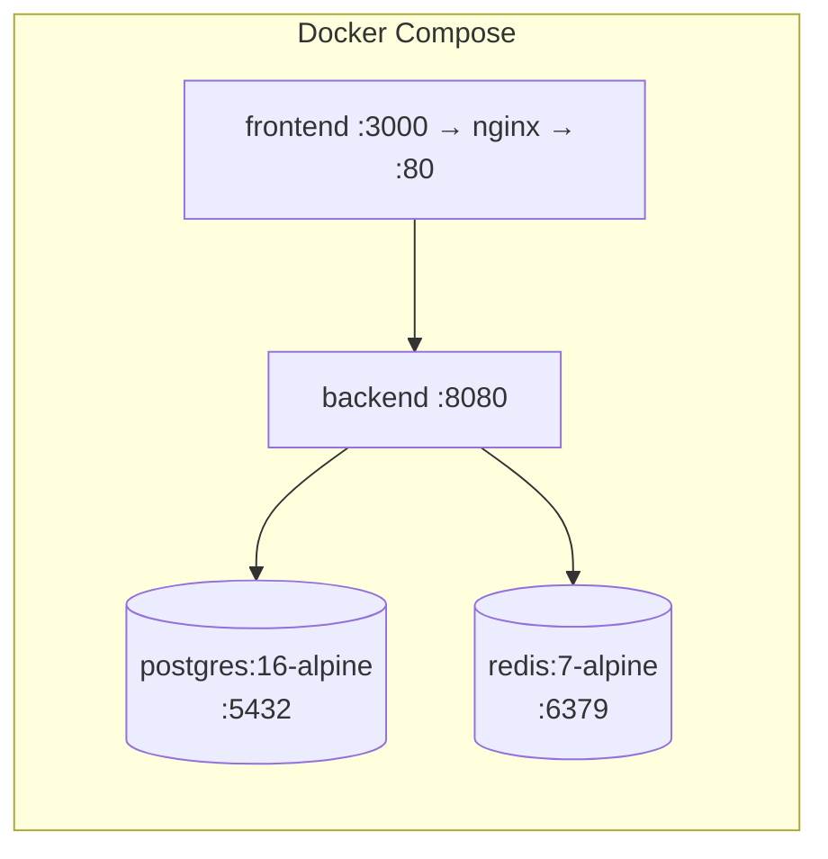

# DevOps Onboarding

## Infrastructure overview



`docker-compose.yml` (repo root) — 4 services:

| Service | Image | Ports | Healthcheck |
|---|---|---|---|
| `postgres` | `postgres:16-alpine` | `5432:5432` | `pg_isready` |
| `redis` | `redis:7-alpine` | `6379:6379` | `redis-cli ping` |
| `backend` | built from `./backend` | `8080:8080` | `wget --spider http://localhost:8080/actuator/health` |
| `frontend` | built from `./frontend` | `3000:80` | none defined |

`backend` depends on `postgres`+`redis` via `service_healthy` conditions; `frontend` depends on
`backend` with no healthcheck condition (plain dependency — frontend can start before backend is
actually healthy).

Postgres initializes from `./database/schema.sql` then `./database/seed.sql` on first boot
(mounted as `docker-entrypoint-initdb.d/01-schema.sql`/`02-schema.sql`).

Named volumes: `postgres_data`, `redis_data`.

## Prerequisites

| Tool | Version |
|---|---|
| Docker + Docker Compose | any recent |
| JDK | 25 (for local backend dev outside Docker — see the Java-version mismatch note below) |
| Node | 20 (matches `frontend/Dockerfile`'s `node:20-alpine`) |
| Maven | 3.6+ |

## ⚠️ Known gap: no CI/CD pipeline exists

Repo-wide search confirmed: no `.github/workflows/*` (project-owned), no `Jenkinsfile`, no
`.gitlab-ci.yml` anywhere in this repository. `[PLANNED / NOT IMPLEMENTED]`. Every build/test/
deploy today is manual. See `CI_CD_PIPELINE.md` for what would need to be built.

## ⚠️ Known gap: Java version mismatch

`pom.xml` requires/targets **Java 25** (`java.version`/`maven.compiler.release=25`).
`backend/Dockerfile` builds and runs on **`eclipse-temurin:21-*-alpine`**. Verify which is
authoritative before trusting the Docker build — as of this audit, building the current
`pom.xml` inside that container image would fail unless the Dockerfile has since been bumped to
a JDK 25 base image.

## Quick start (Docker Compose, full stack)

```bash
docker compose up -d
```

Backend becomes healthy once `/actuator/health` responds (checked every 30s, 5 retries).
Frontend serves the Vite production build via nginx once its container starts (no health-gated
wait on the backend).

## TLS truststore (corporate network only)

If backend outbound HTTPS calls (Yahoo Finance, AMFI, Gemini) fail with PKIX/SSL errors, your
network likely intercepts TLS via a corporate proxy. Run:

```bash
backend/tools/regen-truststore.sh
```

This rebuilds `backend/truststore.p12` (the current JDK's own `cacerts` + your machine's trusted
corporate root certs, exported from the macOS keychain by CN match). Re-run when the JDK is
upgraded or the corporate CA rotates. See `pom.xml`'s `spring-boot-maven-plugin` config for the
`-Djavax.net.ssl.*` JVM arguments this file supports — drop them entirely if you're not behind
such a proxy.
