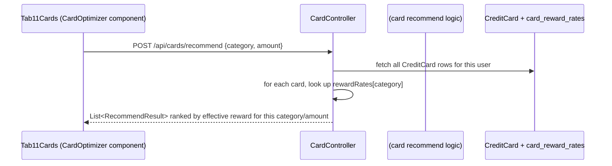
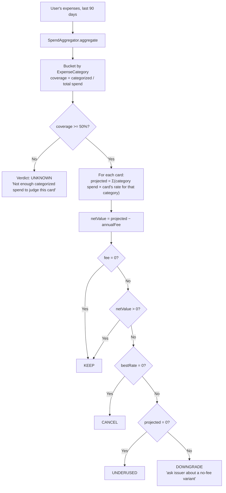
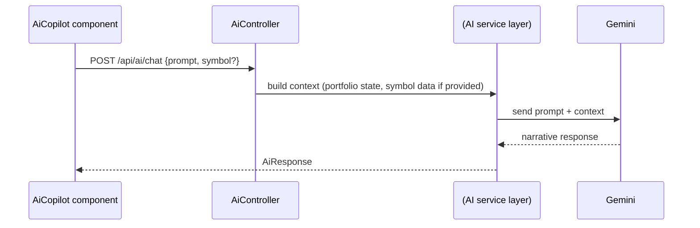
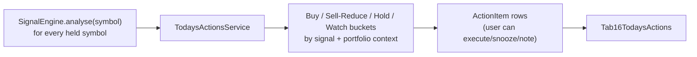

# Flow Trace: Card AI Advisor & Recommendation Flow

## "Which card should I use for this purchase?" (`POST /api/cards/recommend`)

Reward rates come from `CreditCard.rewardRates` (an `@ElementCollection` map, category→rate) —
manually maintained per card, not derived from any external catalog or issuer feed. A separate,
more structured mechanism (`CardRewardRule`, effective-dated with `isStale()`) also exists in the
schema for versioned rate history, but the simple `recommend` endpoint reads the live map on
`CreditCard` directly.

## "Should I keep, downgrade, or cancel this card?" (`CardOptimizerService.analyse`)

**Key honesty constraints, both deliberate**:
1. Categories are **inferred from merchant names**, never presented as real card-network MCC
   data — `SpendAggregator` marks every category `inferred=true`.
2. `rewardsRealized12m` is **always `null`** — the system does not yet have enough per-card
   reward-transaction history to report a *measured* figure, and the code deliberately refuses to
   substitute a projection for a measurement in that field.

## AI Advisor chat / portfolio review (`aiApi.chat`, `aiApi.portfolioReview`)

This path is distinct from the local-first `EmailIntelAgent`/`LlmProviderRouter` used for Gmail
classification (see `02-backend/GMAIL_INGESTION_PIPELINE.md` §6) — `AiController`'s chat/review
endpoints call Gemini directly for narrative generation, not through the same provider-router
abstraction used for structured email classification. Both ultimately depend on
`GEMINI_API_KEY` being configured if Gemini is the active/only provider.

## Today's Investment Actions — the daily signal-to-action bridge

`ActionItem` records what the user *did* with a recommendation (executed/skipped/snoozed) — it
does **not** place any trade. Marking an action "executed" is a manual acknowledgment; the actual
portfolio change (if any) still has to come through the normal transaction path (manual entry or
Gmail import) described in `TRANSACTION_PROCESSING.md`. This system never trades on the user's
behalf.
