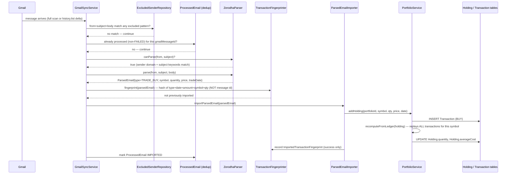

# Flow Trace: Gmail → Portfolio

End-to-end trace of a single email from arrival to appearing as a holding. This is a condensed,
narrative version of `02-backend/GMAIL_INGESTION_PIPELINE.md` — read that document for full
file:line detail; this one is for tracing one concrete example.

## Example: a Zerodha "trade confirmation" email for a stock buy

## What happens if the parser doesn't recognize the email

If no parser's `canParse()` matches, and the email has no PDF attachment, and AI fallback is
enabled: `EmailIntelAgent` classifies it via the local LLM. If confidence ≥ 0.85 **and** the
classified type is importable (not e.g. `INTERNAL_TRANSFER`), it's treated exactly like a
parser's output from this point on — same fingerprint check, same `ParsedEmailImporter` call.

If confidence < 0.85, or the type is non-importable, or the LLM call itself fails: the email
becomes an `EmailReviewItem` instead. **No `Transaction` is ever written for a reviewed-but-not-
yet-decided item.** A human must `ACCEPT`/`EDIT`/`REJECT` it via `POST /api/review/{id}/decision`
— an `ACCEPT`/`EDIT` decision then calls `ParsedEmailImporter` through the exact same path shown
above, including the fingerprint check (so accepting a review item that was somehow also
separately imported another way still cannot double-book it).

## What happens if the same email arrives twice (forwarded, or a duplicate notification)

The Gmail message ID differs (a forward has a new ID), but `TransactionFingerprinter` hashes only
the *financial content* (type+date+amount+symbol+quantity — not message ID or sender). The second
occurrence's fingerprint matches the first, `ParsedEmailImporter` finds the existing
`ImportedTransactionFingerprint` row, and short-circuits with a no-op **before** any table-specific
routing runs. Nothing is written twice.

## What happens if the holding already exists

`recomputeFromLedger` doesn't add to the existing `quantity`/`averageCost` directly — it re-reads
**every** `Transaction` row for that holding (this new BUY plus every prior BUY/SELL) and
recomputes both fields from scratch via weighted-average-cost replay. This is why a manual
correction to a holding is never a direct field edit in this system — it must go through the
ledger (a corrective `Transaction`), or the next sync/reconciliation pass will silently overwrite
the manual correction back to what the ledger implies.

## Where net worth picks this up

The new `Holding.currentValue` (quantity × latest market price) flows into
`PortfolioContextService.build()` the next time `/api/wealth/summary` is called — there is no
separate "recompute net worth" step triggered by the import; net worth is always computed fresh
from current holdings on request, never cached/stale from the import event.
