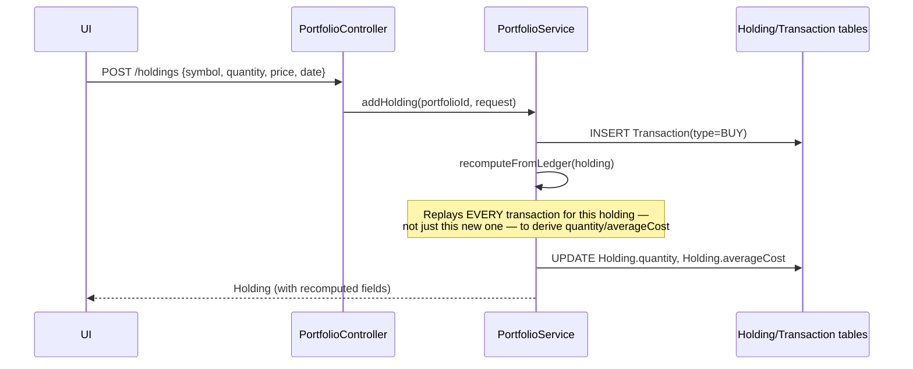
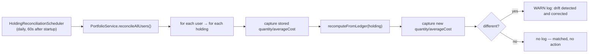

# Flow Trace: Transaction Processing (Buy/Sell/Reconciliation)

## Manual buy (via `POST /api/portfolios/{id}/holdings`)



## Manual sell (via `POST /api/portfolios/{portfolioId}/holdings/{holdingId}/sell`)

```
sellHolding(portfolioId, holdingId, quantity, salePrice)
  → INSERT Transaction(type=SELL, quantity, salePrice)
  → recomputeFromLedger(holding):
        replay all transactions in date order
        each SELL reduces netQty and proportionally reduces totalCost
        (weighted-average-cost model, NOT FIFO/LIFO lot matching)
  → if netQty ≤ 0 after replay: DELETE the holding (fully sold)
  → else: UPDATE quantity/averageCost to the replayed values
```

**Realized P&L is not stored on the `Transaction` row directly** — it is derived at read time by
comparing the sale price against the average cost *as of the moment of that sale* during the
ledger replay, not queried from a stored "profit/loss" column.

## Gmail-imported trade (see `GMAIL_TO_PORTFOLIO_FLOW.md` for the full trace)

Same `recomputeFromLedger` call, reached via `ParsedEmailImporter.importTrade` →
`portfolioService.addHolding`/`sellHolding` instead of the controller. **The recompute logic is
identical regardless of entry path** — manual entry and Gmail import both funnel through the same
ledger-replay method, which is what guarantees they can never disagree about a holding's current
quantity/cost.

## What happens when a SELL has no matching holding

If `ParsedEmailImporter` processes a `TRADE_SELL` `ParsedEmail` and no `Holding` exists for that
symbol (e.g., the corresponding BUY was never imported, or was for a security not tracked in this
portfolio), it does **not** create a negative-quantity holding or silently drop the transaction.
Instead: `importSellAsTransaction` books it as an `Income` row with
`IncomeSource.CAPITAL_GAIN` — the money is recorded as realized income even though there's no
holding to attribute it to.

## Nightly reconciliation (drift detection)



This job exists because a holding's stored fields *should* always equal what the ledger implies —
if they ever diverge (a bug, a direct DB edit, a migration artifact), this job silently corrects
it and logs the fact that a correction happened. It does not alert externally; the log line is the
only signal (see `04-devops/MONITORING_AND_LOGGING.md`).

## Manual holding correction (the one case that looks like a direct edit but isn't)

`PUT /api/portfolios/{portfolioId}/holdings/{holdingId}` accepts a direct
`{quantity, averageCost, ...}` patch from the UI. This is the **one legitimate exception** to
"never directly set Holding fields" — but even here, the underlying implementation still routes
through the same ledger-consistency model conceptually: a manual correction is only meaningful
until the next `recomputeFromLedger` pass (nightly reconciliation, or the next buy/sell on that
holding) recomputes from the transaction history and overwrites it. If a manual correction needs
to persist, the correct fix is to also correct the underlying `Transaction` history, not just the
`Holding` snapshot.
