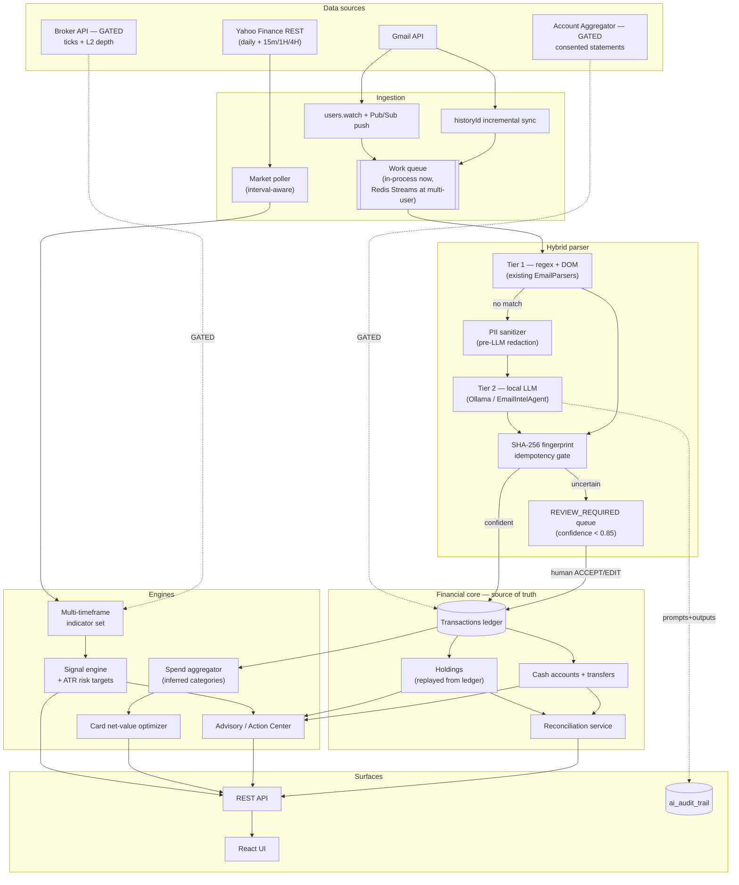

# Wealth-OS Modernization — Architecture, Schemas & Roadmap

Status: design document. Dated 2026-09-15. Grounded against the codebase as it stands, not against an idealized system.

---

## 0. Feasibility gate (read first)

Three items in the brief have **no data source behind them today**. Building them as specified would mean inventing the inputs, so they are gated rather than designed around.

| Requirement | Verdict | Grounding |
|---|---|---|
| Multi-timeframe 15M / 1H / 4H | **Buildable now** | `YahooFinanceClient.getHistory(symbol, range, interval)` is already interval-parameterized. `MarketDataService:185` just hardcodes `"1d"`. |
| ATR-based stop-loss / take-profit / R:R | **Buildable now** | `TechnicalIndicatorService.calculateATR(history, 14)` already exists and is already surfaced on the DTO. |
| RSI / MACD / SMA / EMA / Bollinger | **Exists** | All implemented in `TechnicalIndicatorService`. |
| Market structure (HH/HL, LH/LL) | **Buildable now** | Pure derivation from OHLC bars we already store. |
| Volume profile | **Partial** | Daily volume is stored. True volume-*profile* (volume-at-price) needs intraday bars — arrives with the 15M/1H work. |
| **Order book depth / imbalance / liquidity levels** | **NOT ACHIEVABLE** | Zero L2 data in the system; Yahoo Finance does not publish it. Requires a paid broker feed (Kite Connect / Upstox / Angel One SmartAPI). No amount of code produces this. |
| **WebSocket tick ingestion** | **Blocked by the same gap** | Yahoo is REST-poll only. A tick stream requires the same broker subscription. |
| Kafka / Redis Streams event bus | **Disproportionate** — see §1.3 | Single-user deployment, one Postgres, one JVM on one Mac. |
| Gmail `users.watch` + Pub/Sub push | **Buildable, with an infra prerequisite** | Needs a public HTTPS webhook. Backend currently runs on `localhost:8080` (the codebase carries an `ngrok-skip-browser-warning` header, so tunnelling is already in play). |
| Gmail `historyId` incremental sync | **Buildable now** | Pure Gmail API work, no new infra. |
| **True MCC codes** | **NOT ACHIEVABLE from email** | MCCs live in the card-network authorization feed. Bank/card *emails* carry merchant strings only. We can build an MCC-*shaped* taxonomy inferred from merchant normalization — that is a different, weaker thing and must be labelled as inferred. |
| Net-value card optimizer | **Buildable now** | `CardCatalog.CatalogCard` already carries `annualFee`, `rewardRates`, `annualFeeWaiverSpend`. |

### What this means for the signal engine

A confluence score that silently drops the microstructure factor is a **lie about its own confidence** — an 80% score computed from 4 of 6 intended factors is not the same instrument as an 80% from 6 of 6. The schema in §2.1 therefore makes every factor's availability explicit, and caps confidence when inputs are missing. This follows the `dataQuality: FULL | PARTIAL | INSUFFICIENT` precedent already in `TechnicalAnalysisDto`.

### The higher-leverage upgrade the brief doesn't mention

Benchmarking against the named platforms points somewhere other than streaming infrastructure:

- **MaxRewards** does not parse emails for card data — it connects to card issuers directly, so its reward and balance data is authoritative at the source. Its accuracy advantage is a *data-rail* advantage, not a parser advantage.
- **INDmoney / Kuvera / ET Money** aggregate holdings through broker and depository rails (and increasingly RBI's **Account Aggregator** framework) rather than inferring them from mail.
- **CRED** does lean on statement ingestion, but over a narrow, high-volume, well-known set of issuer formats.

Our ingestion is email-derived. The obvious conclusion is "move to authoritative rails" — but researching what is actually available in India in 2026 **overturns half of that conclusion**, so it is recorded here in corrected form.

**Account Aggregator is not available to us, and would not solve cards anyway.** Two findings, both decisive:

1. **Eligibility.** Becoming an FIU requires the *entity* to be regulated by RBI, SEBI, IRDAI or PFRDA, plus ReBIT-conformant implementation, Sahamati empanelment, security audit and re-certification on code change. First-year cost is estimated at ₹5–25 lakh. Routing through a TSP (Setu / Finvu / Finarkein / OneMoney) does not avoid this — a regulated FIU of record is still required. **There is no hobbyist or single-user tier.**
2. **Scope.** Per Sahamati's own FI-type list, **credit cards are not in the AA framework at all** — not live, not even proposed. AA covers deposits, MF, equities, insurance, NPS and GST.

So for card and spend data, **email/SMS parsing is the permanent rail, not technical debt to be retired**. CheQ's published privacy policy confirms it extracts card transaction data from user SMS and email; the whole Indian category does the same, because no Plaid/MX equivalent for card transactions exists here. The existing parser + review-queue architecture is therefore the *correct* long-term design for that domain, and effort is better spent hardening it than waiting for a rail that is not coming.

**What is genuinely available:**

- **CAS (CDSL / NSDL consolidated account statement)** — covers equities and mutual funds, needs no regulatory approval, decades of format stability. This is the strongest un-gated upgrade for holdings accuracy and was missed in the first draft of this document.
- **Broker APIs.** Verified current positions: **Dhan (DhanHQ v2) is free and is the only one exposing 20-level depth** via a dedicated depth feed; Angel One SmartAPI is free with 5-level; **Kite Connect charges ₹500/month for market data** (its free "Personal" plan excludes it); Upstox has an announced per-order levy. For a single-user personal app, **Dhan is the pick** — it unblocks §1's microstructure requirements at zero subscription cost.

**Corrected recommendation:** the highest-value gated item is a **broker API (Dhan)**, not Account Aggregator. AA should be modelled as a possible future connector behind a pluggable ingestion interface, never as a v1 dependency.

One anti-pattern to avoid explicitly: MaxRewards achieves its coverage by **storing bank credentials and scraping logins** (their own help centre documents this for Amex, which has no US API), which reportedly triggers issuer fraud locks. We will not store third-party credentials under any circumstances.

---

## 1. Target architecture

### 1.1 Diagram



### 1.2 Storage change required for multi-timeframe

`PriceHistory.date` is a `LocalDate` — it structurally cannot hold an intraday bar. Minimum change:

```
price_history
  + bar_start   TIMESTAMP   NOT NULL     -- replaces/augments `date`
  + interval    VARCHAR(5)  NOT NULL     -- '15m' | '60m' | '1d'
  UNIQUE (symbol, interval, bar_start)   -- replaces the daily-only key
```

Retention note: Yahoo caps intraday history (~60 days at 15m, ~730 days at 1h). A 4H series is best **derived by resampling 1H locally** rather than requested, since Yahoo does not serve a native 4H interval.

### 1.3 On Kafka

Recommend **against** Kafka, and against Redis Streams for now. The workload is one user's mailbox and a few hundred symbols on a single-JVM deployment; a broker cluster adds an operational failure domain larger than the thing it coordinates. The genuine problem the brief identifies — *"batch statement bursts causing request timeouts"* — is real and is solved by **decoupling sync from the HTTP request** (a bounded worker pool + a durable job table), not by a distributed log.

The measured driver: local-LLM classification runs **~8.2 s/email** (qwen2.5:7b, measured). At 300 emails that is ~40 min of work that must not sit inside a request. Job-table + worker fixes that completely at single-user scale.

Promote to Redis Streams when *either* becomes true: (a) more than one backend instance, or (b) multi-tenant. The queue is behind an interface so this swap is a config change.

---

## 2. JSON schemas

### 2.1 Buy/Sell signal payload

Design rule: **a factor that could not be computed is `null` with a stated reason — never 0, and never silently dropped from the denominator.**

```jsonc
{
  "$schema": "https://json-schema.org/draft/2020-12/schema",
  "title": "SignalPayload",
  "type": "object",
  "required": ["symbol", "asOf", "signal", "confidence", "dataQuality", "factors", "rationale"],
  "properties": {
    "symbol":      { "type": "string", "examples": ["HDFCBANK"] },
    "asOf":        { "type": "string", "format": "date-time",
                     "description": "As-of time of the newest bar used, NOT the request time." },
    "priceAtSignal": { "type": ["number", "null"] },

    "signal":     { "enum": ["BUY", "SELL", "HOLD", "INSUFFICIENT_DATA"] },
    "confidence": { "type": ["integer", "null"], "minimum": 0, "maximum": 100,
                    "description": "Null when dataQuality=INSUFFICIENT. Capped by confidenceCeiling." },
    "confidenceCeiling": { "type": "integer",
                    "description": "Max attainable confidence given which factors were available. A 4-of-6 read cannot return 100." },

    "dataQuality": { "enum": ["FULL", "PARTIAL", "INSUFFICIENT"] },
    "timeframesUsed":    { "type": "array", "items": { "enum": ["15m", "60m", "4h", "1d"] } },
    "timeframesMissing": { "type": "array", "items": { "type": "string" },
                    "description": "e.g. ['15m: only 12 bars available, need 30']" },

    "factors": {
      "type": "object",
      "description": "Each factor scores -100..+100, or is null with a reason.",
      "properties": {
        "trend":          { "$ref": "#/$defs/factor" },
        "momentum":       { "$ref": "#/$defs/factor" },
        "marketStructure":{ "$ref": "#/$defs/factor" },
        "volume":         { "$ref": "#/$defs/factor" },
        "volatility":     { "$ref": "#/$defs/factor" },
        "microstructure": { "$ref": "#/$defs/factor",
                    "description": "Always null until a broker L2 feed exists. reason='no order book data source'." }
      }
    },

    "execution": {
      "type": ["object", "null"],
      "description": "Null for HOLD/INSUFFICIENT_DATA — no entry is being proposed.",
      "required": ["entryLow", "entryHigh", "stopLoss", "takeProfit", "riskRewardRatio", "atr", "basis"],
      "properties": {
        "entryLow":        { "type": "number" },
        "entryHigh":       { "type": "number" },
        "stopLoss":        { "type": "number" },
        "takeProfit":      { "type": "number" },
        "riskRewardRatio": { "type": "number", "examples": [2.4] },
        "atr":             { "type": "number" },
        "atrPeriod":       { "type": "integer", "default": 14 },
        "atrMultipleStop": { "type": "number", "default": 1.5 },
        "atrMultipleTarget":{ "type": "number", "default": 3.0 },
        "basis":           { "type": "string",
                    "examples": ["Stop 1.5xATR(14)=₹42.10 below entry; target 3.0xATR for 2.0:1 R:R."] },
        "positionSizing":  { "type": ["object", "null"],
                    "description": "Null unless a tracked cash balance exists — an amount with no funding behind it is invented.",
                    "properties": {
                      "suggestedAmount": { "type": ["number", "null"] },
                      "limitedBy": { "enum": ["CASH", "CONCENTRATION_GUIDELINE", "NOT_SIZED"] }
                    } }
      }
    },

    "guardrails": {
      "type": "array",
      "description": "Triggered mitigations. A non-empty list explains a suppressed or downgraded signal.",
      "items": {
        "type": "object",
        "properties": {
          "rule":   { "enum": ["LOW_VOLUME_TRAP", "COUNTER_TREND", "WIDE_SPREAD_PROXY",
                               "EARNINGS_BLACKOUT", "INSUFFICIENT_BARS", "STALE_DATA"] },
          "action": { "enum": ["SUPPRESSED", "DOWNGRADED", "FLAGGED"] },
          "detail": { "type": "string" }
        }
      }
    },

    "rationale": {
      "type": "array",
      "description": "Human-readable, one line per contributing factor. Generated from `factors`, never free-written by an LLM.",
      "items": { "type": "string" },
      "examples": [[
        "1H MACD crossed above signal 3 bars ago (+38).",
        "Daily structure: higher highs and higher lows since 2026-08-12 (+45).",
        "15m volume 0.6x its 20-bar average — thin; confidence capped.",
        "Order book imbalance unavailable (no L2 data source)."
      ]]
    },

    "engineVersion": { "type": "string", "examples": ["signal-engine/2.0.0"] }
  },

  "$defs": {
    "factor": {
      "type": "object",
      "required": ["score", "weight"],
      "properties": {
        "score":     { "type": ["number", "null"], "minimum": -100, "maximum": 100 },
        "weight":    { "type": "number" },
        "timeframe": { "type": ["string", "null"] },
        "detail":    { "type": ["string", "null"] },
        "reason":    { "type": ["string", "null"],
                       "description": "Required when score is null. e.g. 'no order book data source'." }
      }
    }
  }
}
```

### 2.2 Parsed transaction payload (email sync)

Mirrors the pipeline already built (`EmailIntelType`, fingerprint gate, review queue).

```jsonc
{
  "title": "ParsedTransaction",
  "type": "object",
  "required": ["sourceRef", "classification", "confidence", "outcome", "fingerprint"],
  "properties": {
    "sourceRef": {
      "type": "object",
      "required": ["provider", "messageId"],
      "properties": {
        "provider":     { "enum": ["GMAIL"] },
        "messageId":    { "type": "string" },
        "threadId":     { "type": ["string", "null"] },
        "historyId":    { "type": ["string", "null"] },
        "attachmentId": { "type": ["string", "null"] },
        "receivedAt":   { "type": "string", "format": "date-time" },
        "sender":       { "type": "string" }
      }
    },

    "classification": {
      "enum": ["UPI_EXPENSE","CARD_EXPENSE","NETBANKING_EXPENSE","ATM_WITHDRAWAL",
               "AUTO_DEBIT_EXPENSE","EMI_PAYMENT","BILL_PAYMENT",
               "CARD_BILL_GENERATED","CARD_BILL_PAID",
               "STOCK_BUY","STOCK_SELL","DIVIDEND",
               "MF_SIP","MF_LUMPSUM","MF_REDEMPTION","MF_SWITCH",
               "FD_OPEN","FD_MATURITY","RD_OPEN","RD_INSTALLMENT",
               "SALARY","INTEREST_CREDIT","REFUND","RENTAL_INCOME",
               "INTERNAL_TRANSFER","SELF_TRANSFER",
               "OTP_OR_ALERT","PROMOTIONAL","STATEMENT_ONLY","UNKNOWN"]
    },
    "confidence": { "type": ["number", "null"], "minimum": 0, "maximum": 1,
                    "description": "Null means unknown — treated as low, never as permission to import." },

    "parsedBy": { "enum": ["TIER1_REGEX", "TIER1_DOM", "TIER2_LLM", "HUMAN_REVIEW"] },
    "outcome":  { "enum": ["IMPORTED", "REVIEW_REQUIRED", "NOT_A_TRANSACTION", "UNRESOLVED", "DUPLICATE"] },

    "fingerprint": {
      "type": "object",
      "description": "Idempotency key. Content-derived, so a forwarded copy with a new messageId still collides.",
      "required": ["sha256", "inputs"],
      "properties": {
        "sha256": { "type": "string" },
        "inputs": { "type": "array", "items": { "type": "string" },
                    "examples": [["type","date","amount","symbolOrFolio","direction"]] }
      }
    },

    "fields": {
      "type": "object",
      "description": "Every value nullable. A missing figure is null — never coerced to 0.",
      "properties": {
        "amount":        { "type": ["number", "null"] },
        "direction":     { "enum": ["DEBIT", "CREDIT", null] },
        "valueDate":     { "type": ["string", "null"], "format": "date" },
        "merchantRaw":   { "type": ["string", "null"], "description": "As it appeared in the narration." },
        "merchantNormalized": { "type": ["string", "null"], "examples": ["Swiggy"] },
        "inferredCategory":   { "type": ["string", "null"],
                    "description": "INFERRED from merchant — NOT a card-network MCC. See §0." },
        "mccConfidence": { "type": ["number", "null"] },
        "instrument":    { "type": ["string", "null"], "examples": ["UPI", "CARD", "NEFT"] },
        "cardLast4":     { "type": ["string", "null"] },
        "bank":          { "type": ["string", "null"] },
        "symbol":        { "type": ["string", "null"], "description": "Resolved against the stock master; null if ambiguous." },
        "quantity":      { "type": ["number", "null"] },
        "price":         { "type": ["number", "null"] },
        "units":         { "type": ["number", "null"] },
        "nav":           { "type": ["number", "null"] },
        "folio":         { "type": ["string", "null"] }
      }
    },

    "review": {
      "type": ["object", "null"],
      "properties": {
        "reason":   { "type": "string" },
        "evidence": { "type": "string", "description": "Verbatim source sentence the figures came from." },
        "reasoning":{ "type": "string" }
      }
    },

    "privacy": {
      "type": "object",
      "properties": {
        "piiRedacted":   { "type": "boolean" },
        "redactedKinds": { "type": "array", "items":
                           { "enum": ["ACCOUNT_NUMBER","PAN","PHONE","EMAIL","ADDRESS","PASSWORD","TOKEN"] } },
        "sentToLlm":     { "type": "boolean" }
      }
    }
  }
}
```

### 2.3 Card recommendation & optimizer output

```jsonc
{
  "title": "CardOptimizerResult",
  "type": "object",
  "required": ["generatedAt", "spendWindow", "portfolio"],
  "properties": {
    "generatedAt": { "type": "string", "format": "date-time" },

    "spendWindow": {
      "type": "object",
      "required": ["days", "observedSpend", "annualizationBasis", "coverage"],
      "properties": {
        "days":          { "type": "integer", "default": 90 },
        "observedSpend": { "type": "number" },
        "annualizationBasis": { "type": "string",
                    "examples": ["90d observed x 4.06; not seasonally adjusted"] },
        "coverage":      { "type": "number", "minimum": 0, "maximum": 1,
                    "description": "Share of spend with a confidently inferred category. Low coverage must weaken every downstream claim." },
        "byCategory": {
          "type": "array",
          "items": {
            "type": "object",
            "properties": {
              "category":       { "type": "string", "examples": ["Dining"] },
              "observedAmount": { "type": "number" },
              "projectedAnnual":{ "type": "number" },
              "txnCount":       { "type": "integer" },
              "inferred":       { "type": "boolean", "description": "True — we have no true MCC feed." }
            }
          }
        }
      }
    },

    "portfolio": {
      "type": "array",
      "description": "Verdict per card the user already holds.",
      "items": {
        "type": "object",
        "required": ["cardId", "cardName", "verdict", "annualFee", "projectedAnnualRewards", "netValue"],
        "properties": {
          "cardId":   { "type": "integer" },
          "cardName": { "type": "string" },
          "annualFee":{ "type": "number" },
          "feeWaiverSpend":   { "type": ["number", "null"] },
          "feeWaiverProgress":{ "type": ["number", "null"], "minimum": 0, "maximum": 1 },
          "projectedAnnualRewards": { "type": "number" },
          "netValue": { "type": "number", "description": "projectedAnnualRewards - annualFee" },
          "breakEvenSpend": { "type": ["number", "null"], "description": "Null when the card has no annual fee." },
          "verdict":  { "enum": ["KEEP", "DOWNGRADE", "CANCEL", "UNDERUSED"] },
          "verdictBasis": { "type": "string",
                    "examples": ["Fee ₹10,000 exceeds 12-month rewards of ₹6,240 — ₹3,760 net negative."] },
          "rewardsRealized12m": { "type": ["number", "null"],
                    "description": "Actual, from the ledger. Null when history is shorter than 12 months — projection is not evidence." }
        }
      }
    },

    "newCardRecommendations": {
      "type": "array",
      "description": "Emitted ONLY where netValueGain > 0.",
      "items": {
        "type": "object",
        "required": ["cardName", "issuer", "netValueGain", "basis"],
        "properties": {
          "cardName": { "type": "string" },
          "issuer":   { "type": "string" },
          "annualFee":{ "type": "number" },
          "projectedAnnualRewards": { "type": "number" },
          "currentAnnualRewards":   { "type": "number" },
          "netValueGain": { "type": "number",
                    "description": "projectedNew - currentRewards - annualFee. Must be > 0 to appear." },
          "topCategories": { "type": "array", "items": { "type": "string" } },
          "basis":     { "type": "string" },
          "dataAsOf":  { "type": "string", "format": "date",
                    "description": "Reward terms are a maintained static catalog; staleness is a real risk and is surfaced." }
        }
      }
    },

    "bestCardForSpend": {
      "type": ["object", "null"],
      "description": "Response shape for the low-latency [user_id, category, amount] endpoint.",
      "properties": {
        "category": { "type": "string" },
        "amount":   { "type": "number" },
        "best":     { "$ref": "#/$defs/cardOption" },
        "alternatives": { "type": "array", "items": { "$ref": "#/$defs/cardOption" } },
        "excluded": { "type": "array", "items":
                      { "type": "object", "properties": {
                          "cardName": { "type": "string" },
                          "reason":   { "type": "string", "examples": ["Monthly cashback cap already reached"] } } } }
      }
    }
  },

  "$defs": {
    "cardOption": {
      "type": "object",
      "properties": {
        "cardId":        { "type": ["integer", "null"] },
        "cardName":      { "type": "string" },
        "rewardRate":    { "type": "number" },
        "expectedReward":{ "type": "number" },
        "capApplied":    { "type": ["number", "null"] },
        "reason":        { "type": "string" },
        "owned":         { "type": "boolean" }
      }
    }
  }
}
```

---

## 3. Roadmap

Phase names kept as briefed; contents are what is actually buildable.

### Phase 1 — Ingestion infrastructure & queueing

1. **Decouple sync from the HTTP request.** Durable `sync_job` table + bounded worker pool. This is the fix for burst timeouts and for the measured ~8.2 s/email LLM cost. *No broker required.*
2. **`historyId` incremental sync.** Persist `GmailToken.lastHistoryId`; fetch deltas via `users.history.list` instead of re-scanning 300 messages.
3. **`users.watch` + Pub/Sub push.** Requires a stable public HTTPS endpoint — deploy, or a persistent tunnel. Keep the 30-min poll as fallback (watch registrations expire after 7 days and must be renewed).
4. **PII sanitizer before Tier 2.** Redaction currently happens on the *audit write* (`AiAuditService.redact`); move it to the *prompt build* so account numbers and PAN never reach the model at all. Extend to account numbers + PAN patterns.
5. **Queue behind an interface** so Redis Streams is a later config swap, not a rewrite.

*Exit criteria:* a 300-email sync returns immediately; re-running it creates zero duplicate rows; no raw PAN/account number appears in any prompt.

### Phase 2 — Multi-factor signal engine & spend aggregator

1. **Intraday storage migration** (`bar_start` + `interval`, unique key) — prerequisite for everything else here.
2. **Expose the interval parameter** through `MarketDataService`; backfill 15m/60m; derive 4H by local resampling.
3. **Market-structure detector** (HH/HL vs LH/LL) over each timeframe.
4. **Confluence scorer** emitting the §2.1 schema, with `confidenceCeiling` enforced and `microstructure` explicitly null.
5. **Guardrails**: low-volume trap, counter-trend, stale-data, insufficient-bars.
6. **ATR execution block** — entry zone, stop, target, R:R. Reuses existing ATR.
7. **Spend aggregator**: 90-day rollup by inferred category, with a `coverage` figure that honestly reports how much spend could not be categorized.

*Exit criteria:* every signal states which timeframes it used; a thin-volume symbol returns a suppressed or capped signal rather than a confident one; backtest harness reports hit-rate by confidence band.

### Phase 3 — Net-value optimizer & signal accuracy dashboard

1. **Card net-value engine** per §2.3: projected rewards, fee-waiver progress, break-even, KEEP/DOWNGRADE/CANCEL.
2. **New-card recommendations**, suppressed unless `netValueGain > 0`.
3. **`POST /api/cards/best-for-spend`** — low-latency, cap-aware, returns alternatives *and* exclusion reasons.
4. **Reward-ledger** (`RewardTransaction`) so `rewardsRealized12m` is measured rather than projected.
5. **Signal accuracy dashboard** — the honest scoreboard: realized outcome vs. predicted, bucketed by confidence band. If 80%-confidence signals do not outperform 50%-confidence ones, the score is decorative and the engine needs recalibration, not more factors.

*Exit criteria:* no card verdict rests on projection where measurement was available; the accuracy dashboard is populated from real closed signals.

### Gated track (unblock by subscription, not by code)

- **Broker API** (Kite Connect / Upstox / Angel One) → tick stream + L2 depth. Unblocks WebSocket ingestion, order-book imbalance, liquidity levels, true volume profile, and authoritative holdings.
- **Account Aggregator** → consented, structured bank/investment data; retires large parts of email parsing.

Until one of these lands, §1's microstructure requirements stay `null`-with-reason in the schema. That is the honest representation, and it is deliberately visible in the payload rather than hidden behind a confident-looking number.

---

## 3b. Research-derived design corrections

Findings from the industry reference pass that change the designs above. Recorded because each one invalidates something that looked reasonable.

### Confluence scoring: count independence, not indicators

TradingView's Technical Ratings — the public reference implementation — averages 26 indicators (15 MAs, 11 oscillators) as +1/0/−1 votes, two group means averaged, thresholds at ±0.1 (Buy/Sell) and ±0.5 (Strong).

But measured Spearman correlation across indicators shows RSI, ROC, CCI, Stochastic, %b, MACD-line and MA-distance form **one cluster with pairwise ρ typically > 0.90**. Those 11 oscillators are closer to **2–3 independent signals**. Equal-weight voting therefore over-weights momentum roughly 4:1 while presenting itself as broad confluence. MACD *histogram* is the notable outlier (avg ρ ≈ 0.35) because it is a second derivative.

**→ The §2.1 factor design is correct and should be held to:** score **one vote per family** (trend / momentum / structure / volume / volatility), never one vote per indicator. Adding a fourth momentum oscillator must not move the score.

### Look-ahead bias is the classic multi-timeframe bug

Reading a higher-timeframe bar before it closes leaks future information and inflates any backtest. **→ Compute confluence only from *closed* bars, lag higher-timeframe indicator values by one bar, and store each signal with both its timeframe and its bar-close timestamp** (already reflected in `asOf` being the newest bar used, not request time).

### ATR conventions — adjust the defaults

Convention is **2×ATR** for stops (sometimes 3×), not the 1.5× placeholder in §2.1. Position sizing follows Van Tharp's percent-risk model: `size = (equity × risk%) / (entry − stop)`, with 0.5–2% risk per trade (1% default) and targets expressed in R-multiples. **→ Update `atrMultipleStop` default to 2.0 and express targets as R-multiples.** Note `positionSizing` still returns null without a tracked cash balance — the formula needs an equity figure, and inventing one is exactly the failure this project guards against.

### Card reward terms: model them as versioned facts, not constants

Every comparable product — MaxRewards, CardPointers, and India's open-source ccreward.app — **hand-curates reward terms**. No issuer publishes a machine-readable feed; T&Cs are PDFs. In India, TechnoFino forum threads are the de facto source of truth and routinely catch devaluations before comparison sites update.

Our `CardCatalog` is a hardcoded Java class with no notion of when a rate was last true. Given how often Indian issuers devalue, **a net-value figure without a freshness indicator is actively misleading**.

**→ Two changes to §2.3:** (a) reward rules become **effective-dated rows** (`effective_from`, `effective_to`, `source_url`, `last_verified_at`) with staleness surfaced in the UI; (b) caps, milestones and fee waivers make optimization **stateful and path-dependent** — the best card for a ₹5,000 spend depends on month-to-date spend per category per card, and waiver thresholds make it a year-long allocation problem. The "best card" endpoint must read cycle-to-date state, not just a rate table.

## 4. Non-negotiables carried forward

These hold regardless of phase:

- **The ledger is the source of truth.** Holdings are replayed from transactions; nothing hand-sets a quantity.
- **Transfers never change net worth.** Bank → MF is an allocation shift.
- **Recommendations never mutate holdings.** The Action Center records disposition only.
- **The LLM supplies semantics; backend code does all arithmetic, all resolution, all writes.**
- **Never fabricate, estimate, duplicate, silently drop, or overwrite a financial record.** A missing input yields `null` and a reason — not a zero, and not a guess.
