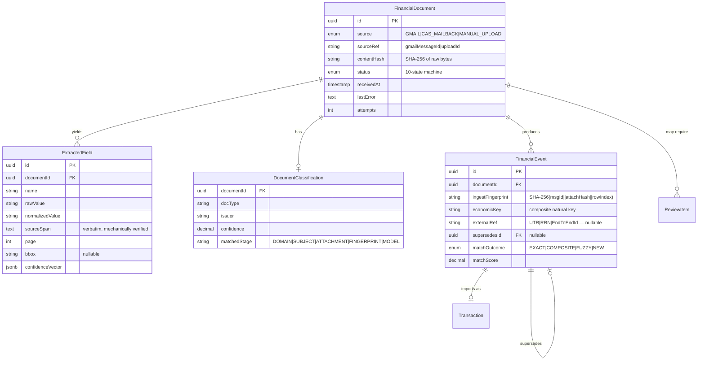
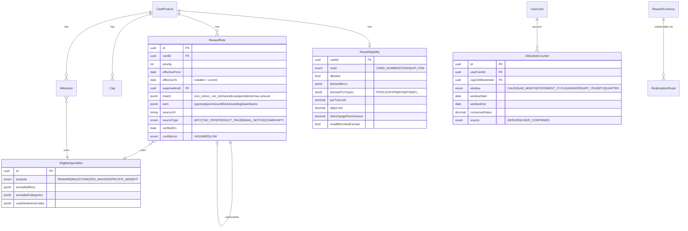
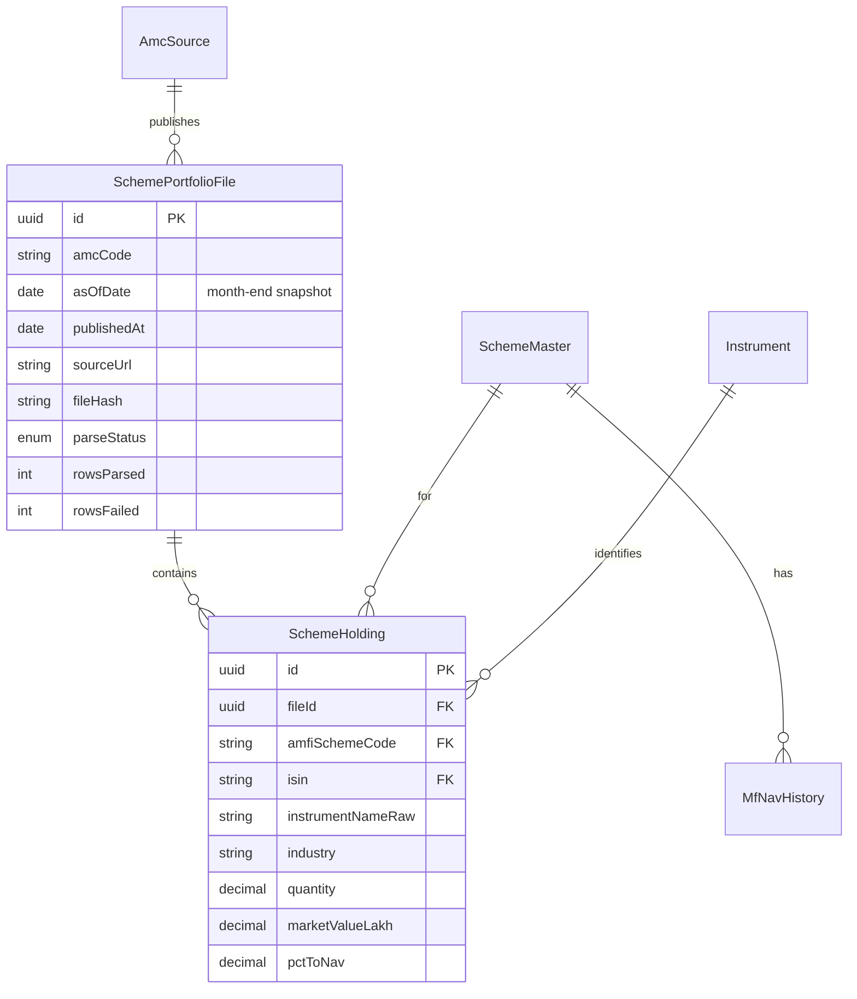
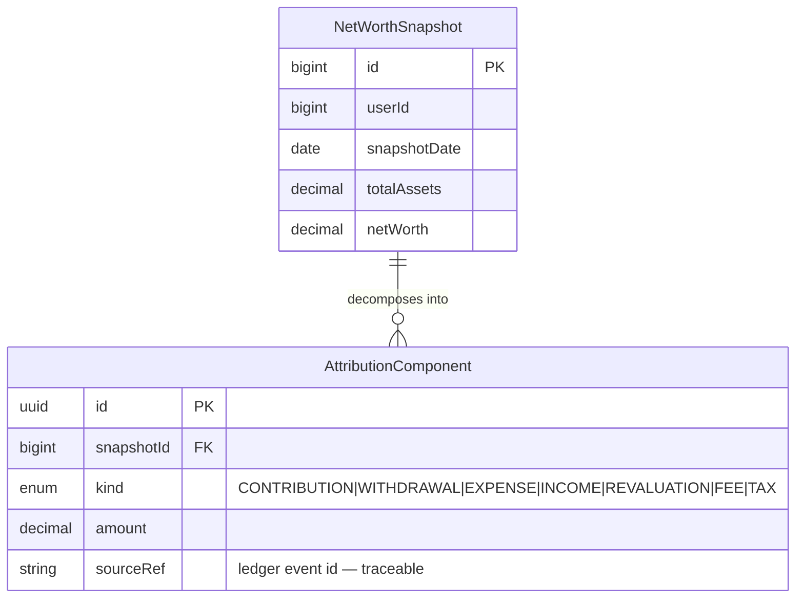
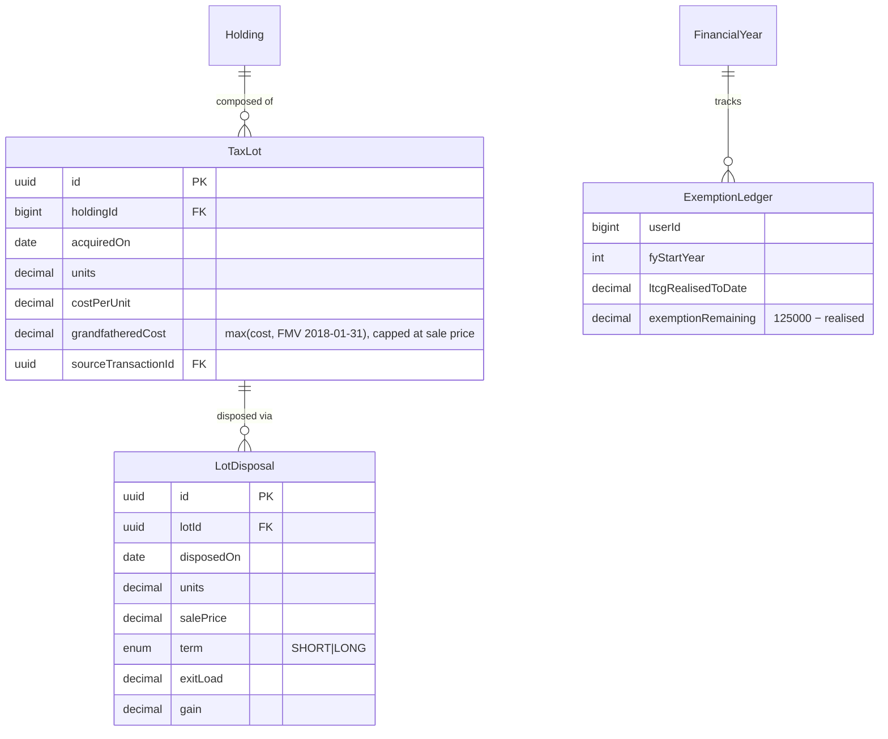

# Data Architecture (Target)

> Target-state data design. See [`../01-architecture/DATABASE_ARCHITECTURE.md`](../01-architecture/DATABASE_ARCHITECTURE.md)
> for the current schema (28 domains, entity inventory, index summary, the `Long userId` vs
> `@ManyToOne User` inconsistency recorded as ADR-9).

---

## 1. The three data tiers

Data in this system falls into exactly three tiers, and **the tier determines the mutation
rules**. Most data bugs in financial software come from treating one tier like another.

| Tier | Mutability | Examples | Rule |
|---|---|---|---|
| **Observed** | Append-only, never edited | `FinancialDocument`, `ExtractedField`, `Transaction` | A correction is a **new row linked to the old one**, never an update |
| **Derived** | Recomputable, freely overwritten | `Holding.quantity`, `Holding.averageCost`, net worth, scores | Written by **exactly one** function; deleting and recomputing must produce identical output |
| **Reference** | Versioned with effective dates | `CardRewardRule`, `Cap`, `Milestone`, NAV, prices, tax rates | Every row carries `effective_from`/`effective_to` and provenance |

> **The test for tier confusion:** if you can delete a row and regenerate it exactly from other
> data, it's Derived. If you can't, it's Observed and must never be edited in place.
> `Holding` is Derived. `Transaction` is Observed. Conflating them is how ledgers drift.

---

## 2. Document Intelligence entities



### 2.1 Why `sourceSpan` is `NOT NULL`

This one column is what converts *"every financial number must be traceable"* from an aspiration
into a mechanically enforced property. Extraction **fails** if the span cannot be located in the
source text — which is also the cheapest hallucination defence available, because *"LLMs cannot
cite what they haven't seen, regardless of plausibility."*

The alternative — email-level provenance, which is what exists today — answers "which email did
this come from" but not "which words in it said ₹47,300."

### 2.2 Why `confidenceVector` is `jsonb`, not a scalar

Storing the four signals separately means a threshold change can be re-evaluated against
historical documents **without re-extraction**. Collapsing to a scalar at write time throws away
the ability to answer "would the new rule have caught this?"

```json
{
  "arithmetic":      { "passed": true,  "checks": ["debit_credit_balance", "qty_price_net"] },
  "parserAgreement": { "score": 1.0,    "parser": "ZerodhaParser", "disagreements": [] },
  "grounding":       { "score": 1.0,    "unfoundSpans": [] },
  "selfConsistency": { "score": 0.94,   "passes": 3 },
  "modelReported":   0.91
}
```

`modelReported` is **recorded but not trusted** — DocILE puts logprob-based confidence at only
0.705 ROC AUC.

### 2.3 Two fingerprints, two jobs

| Column | Formula | Answers |
|---|---|---|
| `ingestFingerprint` | `SHA-256(gmailMessageId ‖ attachmentHash ‖ rowIndex)` | "Have I processed this *artifact* before?" |
| `economicKey` | `(account, instrument, direction, quantity, amount, date)` normalised | "Have I recorded this *event* before, from any source?" |

The existing `TransactionFingerprinter` already implements the economic side correctly — it
hashes financial content and **deliberately excludes the Gmail message ID**, so a forwarded
email collides with the original. That property is preserved. What's added is the document-layer
fingerprint with row granularity, so a 40-row CAS statement doesn't collapse to one hash.

---

## 3. Reference data: effective dating

Every reference row is versioned. This is not optional for card rules — devaluations arrive with
30–60 days' notice, and our research found the **SBI Cashback cap disagreeing across three
sources**, which is precisely the situation versioning exists to survive.



**Three non-obvious requirements, each traceable to a specific finding:**

1. **`EligibleSpendSet.purpose`** — Kotak maintains *five* lists for five purposes with
   per-variant carve-outs, and says the list "is not exhaustive." One exclusion list per card is
   the most common modelling error in this domain.
2. **`window` distinguishes `CALENDAR_MONTH` from `STATEMENT_CYCLE`** — SBI uses the statement
   cycle, HDFC uses the calendar month. Treating them as one is a silent off-by-days bug on
   every cap.
3. **`confidence` + `sourceType` on every rule** — where issuers don't publish MCC maps we are
   *inferring*. FinArt chose category-level modelling openly for this reason; we should be
   equally explicit rather than presenting an inference as a fact.

**`smallMerchantExempt` drives a band, not a number.** NPCI's reward-parity mandate exempts
issuers earning no interchange, and merchants below ~₹20 lakh turnover are MDR-exempt — so
whether a payment earns anything can depend on a merchant attribute the user cannot observe.

---

## 4. Mutual fund holdings

The subsystem that unlocks overlap, look-through and concentration. **ISIN is the join key.**



**Four properties this schema enforces:**

- **`asOfDate` is stored and surfaced.** Portfolios are month-end snapshots published up to 10
  days later, and Advisorkhoj was observed showing a **~2.5-month-old** portfolio. The as-of date
  is not metadata, it's part of the answer.
- **`rowsFailed` is recorded, not swallowed.** The AMFI NAV outage in this codebase was caused
  by every row dying inside `catch (Exception ignored)` while the feed appeared healthy. Partial
  parse failures must be visible.
- **`pctToNav` is stored raw.** Weights are % of NAV, so cash and debt sit in the denominator —
  two funds each holding 8% cash mechanically cap overlap at 92%. Renormalisation is a
  presentation choice made downstream, not baked into storage.
- **`quantity` is stored alongside the weight**, enabling re-pricing at today's price rather than
  applying a stale month-end weight to a current fund value.

**Overlap**, computed not stored:

```
Overlap(A,B) = Σ min(w_A,i , w_B,i)    for i ∈ (holdings_A ∩ holdings_B)
```

Publish the formula on the surface. Advisorkhoj shows **counts** with no published methodology,
so our number will legitimately differ from theirs and users will ask why.

**Look-through**, the Morningstar X-Ray model:

```
EffectiveExposure(S) = DirectValue(S) + Σ_f ( Value(f) × w_f,S )
```

Refuse to compute when the underlying portfolio is older than ~60 days — a fund that has exited
a stock would still show exposure.

---

## 5. Net-worth attribution



`NetWorthSnapshot` **already exists** with the first four columns. `AttributionComponent` is the
addition, and every component carries `sourceRef` back to a ledger event — so
*"₹B came from market movement"* is itself traceable rather than a residual plug.

**The invariant that must hold:**

```
netWorth(T) − netWorth(T-1) == Σ AttributionComponent.amount
```

exactly, to the paisa. `LedgerTransfer` guarantees internal transfers contribute zero — already
proven by an existing test showing a ₹50k bank→MF transfer produces ₹0 net-worth shift.

> **Design note:** revaluation must be *computed*, not left as the residual. A residual absorbs
> every bug in every other component silently. Compute it from price deltas on held quantities,
> then assert the identity closes — and if it doesn't, that's a reconciliation exception, not a
> rounding adjustment.

---

## 6. Tax: lot-level

`TaxService` today aggregates `Income` rows by source string and returns an honest estimate
*range*. It is **already on the correct rates** — 12.5% LTCG above ₹1,25,000 and 20% STCG,
applied to the FY aggregate. **Those constants are right; do not "fix" them.** What's missing is
lot granularity.



**`ExemptionLedger` is the single most important table here.** The ₹1,25,000 exemption is a
**per-financial-year aggregate across all s.112A gains** — listed equity, equity MF, business
trust units — **not per transaction, not per scheme, not per folio.** A per-redemption
calculation is simply wrong, and it is the most commonly mis-implemented rule in Indian retail
finance. Kuvera's own tax-harvesting page still displays the stale ₹1 lakh figure.

**Store section references as data, not literals.** The Income-tax Act 2025 replaces the 1961
Act from 1 April 2026: **111A → 196, 112A → 198**. Rates carry over unchanged, but hard-coded
section strings in user-facing copy go stale on that date.

**Also required for a correct final number:** surcharge (capped at 15% for s.112A) plus 4% health
and education cess. A bare "12.5%" is wrong for high-income users.

---

## 7. Provenance, applied uniformly

Every table whose rows originate outside the user gets the same five columns:

| Column | Purpose |
|---|---|
| `sourceUrl` | Where it came from |
| `sourceType` | `MITC` / `TNC_PDF` / `PRODUCT_PAGE` / `EMAIL_NOTICE` / `COMMUNITY` / `REGULATORY` |
| `verifiedOn` | When a human last confirmed it |
| `confidence` | `HIGH` / `MED` / `LOW` — inference is labelled as inference |
| `supersedesId` | The row this replaced |

This is what makes a **public, dated changelog** possible — which our research found to be a real
gap: TechnoFino's forum is the only structured change-tracking in the Indian card market.

---

## 8. Migration posture

| Principle | Consequence |
|---|---|
| **Additive first** | New tables and nullable columns. No destructive schema change while the old path still serves |
| **Backfill is a job, not a migration** | Grounding spans can't be retrofitted to already-imported emails; the column is nullable for historical rows and `NOT NULL` going forward |
| **Existing entities keep their identity** | `Holding`, `Transaction`, `CashAccount`, `LedgerTransfer`, `EmailReviewItem`, `NetWorthSnapshot` are unchanged. `FinancialDocument` wraps the ingestion path rather than replacing it |
| **`PendingPdf` becomes a projection** | Not dropped. It keeps working while `FinancialDocument` takes over |
| **ADR-9 stays open** | The `Long userId` vs `@ManyToOne User` inconsistency is recorded and deliberately not bundled into this work |

---

## Related

- [`SYSTEM_ARCHITECTURE.md`](SYSTEM_ARCHITECTURE.md) — layers, flow, build sequence
- [`FINANCIAL_LEDGER.md`](FINANCIAL_LEDGER.md) — the invariant and replay semantics
- [`../research/TECHNICAL_GAPS.md`](../research/TECHNICAL_GAPS.md) — evidence for each change
- [`../01-architecture/DATABASE_ARCHITECTURE.md`](../01-architecture/DATABASE_ARCHITECTURE.md) — current schema
