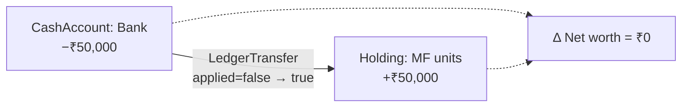

# Financial Ledger

> Unlike the other documents in this directory, this one is **mostly descriptive**. The ledger
> is the part of Wealth OS that is already right. It is documented here because the target
> architecture depends on it staying right, and because the properties below are easy to break
> accidentally.
>
> Sections marked **TARGET** are additions. Everything else describes verified current behaviour.

---

## 1. The invariant

> **`Holding.quantity` and `Holding.averageCost` are derived, never asserted.**

Verified: both are written at exactly one place in the codebase —
`PortfolioService.java:258-259`, inside the private method `recomputeFromLedger`. A grep for
`setQuantity(` / `setAverageCost(` across the whole backend returns other hits only on request
DTOs and on `ActionItem`, never on `Holding`.

The method's own comment records why it exists:

> *"The single place quantity/averageCost is ever derived — always by replaying the full
> BUY/SELL transaction ledger for this holding, never by hand-rolling weighted-average math
> inline (that pattern used to be duplicated across addHolding/sellHolding/merge, and could
> silently drift from what the ledger actually implies)."*

This is the property that makes manual entry and Gmail import structurally incapable of
disagreeing about a holding. Both paths call the same replay.

### 1.1 IMPLEMENTED — defended by a test

`HoldingLedgerInvariantTest` asserts at the **bytecode** level that no type other than
`PortfolioService` calls `Holding.setQuantity` or `Holding.setAverageCost`.

Bytecode rather than source grepping is deliberate: `setQuantity` is also declared on
`ActionItem` and on several request DTOs, so matching the method name in source text produces
false positives. ArchUnit resolves the receiver's actual type.

The test was verified by **injecting a deliberate violation** into an unrelated service and
confirming both rules failed with their guidance message, then reverting. A green architecture
test that cannot go red is worse than no test.

Its failure message points at the fix rather than the symptom:

> *Holding.quantity is derived from the transaction ledger by
> PortfolioService.recomputeFromLedger. Setting it directly makes stored state disagree with the
> ledger that is supposed to explain it. Record a Transaction instead and let the replay derive
> the quantity.*

**If it fails, the fix is almost never to add the offending class to an exception list.**

---

## 2. Replay semantics

**Weighted-average cost, not FIFO or LIFO.**

```
netQty   = 0
totalCost = 0

for each transaction, ordered by transactionDate ascending:

    BUY:
        totalCost += price × quantity
        netQty    += quantity

    SELL:
        sellQty       = min(transaction.quantity, netQty)
        avgCostAtSale = totalCost / netQty          (4 dp, HALF_UP)
        totalCost    -= avgCostAtSale × sellQty
        netQty       -= sellQty
        clamp both at zero

if netQty <= 0 : delete the holding, return null
else           : quantity = netQty
                 averageCost = totalCost / netQty   (2 dp, HALF_UP)
```

Four behaviours worth naming explicitly, because each is a decision:

| Behaviour | Consequence |
|---|---|
| **Oversell is clamped, not rejected** | `sellQty = min(txn.quantity, netQty)`; negative quantities can never be persisted. A sell with no matching holding is booked as `Income(CAPITAL_GAIN)` by `ParsedEmailImporter`, **not silently dropped** |
| **Full sale deletes the holding** | A zero-quantity holding is not a valid state |
| **Realised P&L is not stored** | It is derived at read time from the average cost *as of that sale* during replay. There is no "profit" column to drift |
| **Replay is total, not incremental** | Every transaction for the holding is re-read on every change. O(n) per write, and correct by construction |

### 2.1 Why weighted-average and not FIFO

Weighted-average is what the replay implements today, and it is internally consistent. **But it
is not what Indian capital-gains tax requires.**

> **TARGET — this is a real divergence to resolve, not an oversight to paper over.**
> Indian tax computation needs **lot-level** identification: acquisition date per lot, LT/ST
> classification per lot, grandfathering to `max(cost, FMV 2018-01-31)` per lot, and exit-load
> windows per lot. Weighted-average cost cannot express any of that.
>
> **Proposed resolution:** keep weighted-average as the *portfolio* cost basis (it is the right
> model for "what did this position cost me on average") and add `TaxLot` as a **parallel
> derivation from the same ledger** for tax purposes. Two projections, one source of truth —
> not two sources of truth.
>
> Both must replay from the same `Transaction` rows, and a test should assert that
> `Σ TaxLot.units == Holding.quantity` at all times.

---

## 3. Net-worth neutrality of transfers

The problem this solves, found during an earlier audit: **net worth had no cash component at
all**, so a ₹50,000 bank→MF transfer inflated net worth by the full ₹50,000 — the money appeared
in the MF holding and never left the bank.

`LedgerTransferService.applyCashEffect` performs an equal-and-opposite mutation guarded by an
`applied` flag. Its comment states the guarantee:

> *"…so replaying or re-saving a transfer can never move the money twice."*

An invariant test proves a transfer produces **₹0** net-worth shift.



**This is also the thing that makes net-worth attribution possible.** Research found that nobody
in Indian retail ships an attribution waterfall, and the blocker is not the maths — Modified
Dietz is trivial — it is **transfer-pair detection**. A system that cannot tell "moved ₹50k" from
"earned ₹50k" cannot produce an honest attribution. This codebase already solved that.

---

## 4. Single net-worth formula

`PortfolioContextService.build()` → `/api/wealth/summary` is the **only** net-worth computation.
An earlier audit found six duplicate implementations that could disagree; they were collapsed
into this one.

`NetWorthSnapshot` stores a dated series (`snapshotDate`, `totalAssets`, `netWorth`) written by
`NetWorthService.record()`.

**Net worth is computed fresh on request, never cached from an import event.** A Gmail import
does not trigger a "recompute net worth" step — the next `/api/wealth/summary` call simply sees
the new holding.

---

## 5. TARGET — attribution

```
Δ NetWorth(T-1 → T)  =  net saving  +  revaluation

net saving   =  contributions − withdrawals − expenses + income
revaluation  =  Σ over held instruments of (price_T − price_{T-1}) × quantity_held
```

Modified Dietz for the period return:

```
R = (B − A − F) / (A + Σ Wᵢ·Fᵢ)          Wᵢ = (D − dᵢ) / D
```

where A = beginning value, B = ending value, F = net external flows, `dᵢ` = day of flow i,
D = days in period.

**Three rules that keep this honest:**

1. **Revaluation is computed, not residual.** A residual absorbs every bug in every other
   component silently. Compute it from price deltas, then assert
   `ΔNetWorth == Σ components` to the paisa. **A failure to close is a reconciliation exception,
   not a rounding adjustment.**
2. **Every component carries `sourceRef`** back to a ledger event. "₹B came from market
   movement" must itself be traceable.
3. **Transfers contribute zero by construction** — guaranteed by §3, not by a filter that could
   miss a case.

### 5.1 TARGET — return metric selection

Zerodha's own product contradicts itself here: Console's *portfolio* XIRR covers current holdings
only and "does not take into account historical buy and sell trades," while its *equity holdings*
XIRR page covers all trades since FY2017. Two surfaces, two answers.

We have one ledger, so we have no excuse. **One definition, stated on the surface**, with the
metric selected by horizon:

| Horizon | Single flow | Multiple flows |
|---|---|---|
| < 1 year | Absolute | Absolute |
| ≥ 1 year | CAGR (≡ XIRR) | XIRR |

And **refuse** rather than mislead — Zerodha shows "–" when most holdings are under a year,
because *"the XIRR would be greater than the actual percentage."*

**Four XIRR pitfalls to engineer against:**

- **Switches** must be modelled as paired outflow/inflow on the same date, or they double-count
- **IDCW payouts** are outflows in the flow vector; growth-plan NAV needs no adjustment
- **Partial redemptions** are outflows with the residual valued at the terminal date
- **SIP + STP chains** produce sign-alternating flows where XIRR can have **multiple roots** —
  a bracketed solver must detect this and decline, not return the first root it finds

**Benchmark comparison must use the user's own cash-flow schedule.** Comparing portfolio XIRR to
a raw index return (as INDmoney does) is apples-to-oranges. Computing the benchmark's XIRR under
the user's actual flows is correct and, per our research, rare in Indian retail.

---

## 6. Reconciliation

`HoldingReconciliationScheduler` runs daily (60s after startup) → `reconcileAllUsers()`:
for every holding, capture stored values, `recomputeFromLedger`, compare, and `WARN` if they
differed. A silent correction plus a log line is the only signal today.

`ReconciliationService.checkAll` covers **3 of ~17** checks specified.

### 6.1 TARGET — exception model

Replace binary pass/fail with the industry vocabulary:

| Outcome | Meaning |
|---|---|
| **matched** | Ledger and source agree |
| **unmatched** | Present on one side only |
| **partially-matched** | One deposit covering several ledger entries |
| **exception** | Typed by cause: `TIMING_DIFFERENCE` / `AMOUNT_VARIANCE` / `UNIDENTIFIED` |

Every exception carries the source rows needed to investigate it. And adopt the distinction
between **matching** (pre-commit, blocking) and **reconciliation** (post-commit, comparative) —
they are different controls that today are conflated.

> **Drift should not only be corrected silently. If stored state disagreed with the ledger, that
> is a fact worth surfacing to the user in Data Health, not just to a log file nobody reads.**

---

## 7. Properties to preserve

Any future change must keep all seven true. This list is the regression contract.

| # | Property | Enforced by |
|---|---|---|
| 1 | `Holding.quantity`/`averageCost` have exactly one writer | `HoldingLedgerInvariantTest` (ArchUnit, bytecode) |
| 2 | Manual entry and Gmail import cannot disagree | Both call `recomputeFromLedger` |
| 3 | A holding can never hold negative quantity | `min(sellQty, netQty)` clamp |
| 4 | A sell with no holding is recorded, not dropped | `Income(CAPITAL_GAIN)` fallback |
| 5 | Internal transfers shift net worth by exactly ₹0 | `applyCashEffect` + `applied` flag + invariant test |
| 6 | A forwarded duplicate email cannot double-book | `TransactionFingerprinter` excludes the Gmail message ID |
| 7 | Net worth has exactly one formula | `PortfolioContextService.build()` |

**Properties 1, 5 and 6 each fixed a real bug that had shipped.** They are not theoretical.

---

## 8. What must not change

- **The ledger stays append-only.** Corrections are new rows; the existing manual-correction
  endpoint is explicitly temporary until the next replay overwrites it, and the documented fix
  is to correct the underlying `Transaction`, not the `Holding` snapshot.
- **Event sourcing stays confined to the ledger.** It does not spread to the rest of the system.
  Azure's guidance is explicit about why: projection code becomes effectively immutable, and
  *"even a simple bug fix can cause a butterfly effect as it runs against every transaction since
  the beginning of time."*
- **Derived state is never the source of a decision without recomputation.** If a score, a net
  worth, or a tax figure is stale, recompute it — do not read a cached row and act on it.

---

## Related

- [`SYSTEM_ARCHITECTURE.md`](SYSTEM_ARCHITECTURE.md) — layers and build sequence
- [`DATA_ARCHITECTURE.md`](DATA_ARCHITECTURE.md) — `TaxLot`, `AttributionComponent`, identity model
- [`../01-architecture/ARCHITECTURE_DECISIONS.md`](../01-architecture/ARCHITECTURE_DECISIONS.md) — ADR-1 through ADR-9
- [`../05-flows/TRANSACTION_PROCESSING.md`](../05-flows/TRANSACTION_PROCESSING.md) — the flow trace
