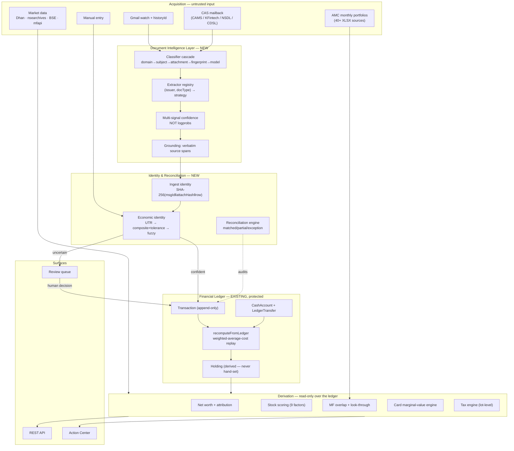
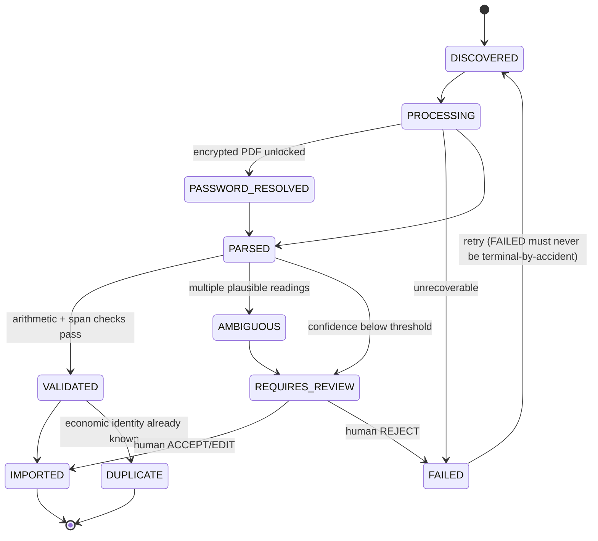
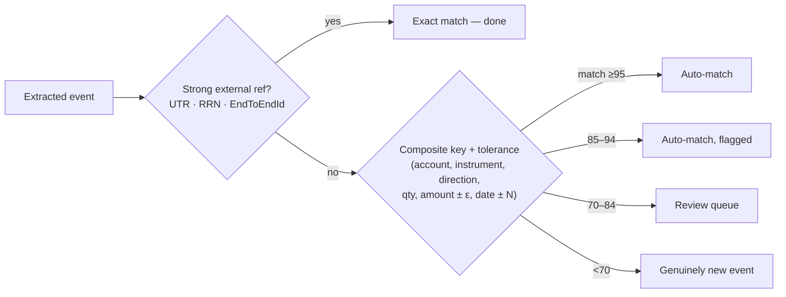
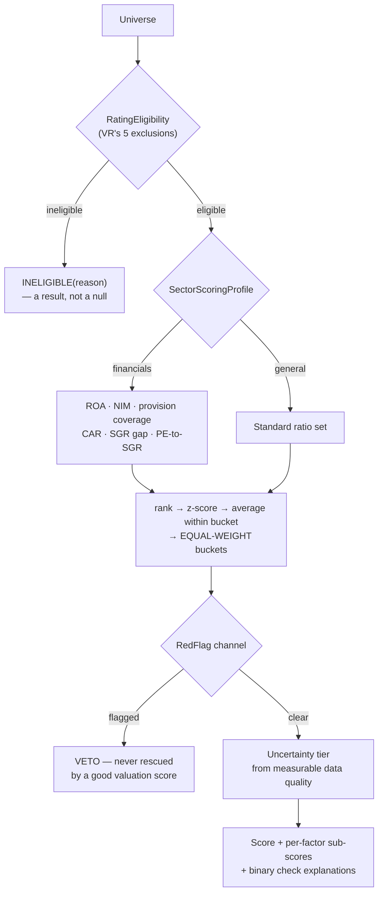
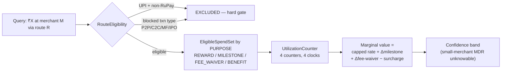

# System Architecture (Target)

> **This directory is the *target* architecture — what we are designing toward.**
> [`docs/01-architecture/`](../01-architecture/) documents the system **as built today** and
> remains the source of truth for current behaviour. Where the two disagree, `01-architecture`
> describes reality and this document describes intent.
>
> Every design choice here traces to a finding in
> [`../research/COMPETITIVE_RESEARCH.md`](../research/COMPETITIVE_RESEARCH.md) or a verified gap
> in [`../research/TECHNICAL_GAPS.md`](../research/TECHNICAL_GAPS.md). **No code has been written
> against this yet.**

---

## 1. The organising principle

The system has one job that everything else is subordinate to:

> **Produce financial numbers that are traceable to a source, reconcilable against that source,
> and honest about what they don't know.**

That is the load-bearing constraint. Three architectural consequences follow, and they are not
negotiable:

1. **The ledger is the only writer of derived financial state.** Verified intact today —
   `Holding.quantity`/`averageCost` are written at exactly one place,
   `PortfolioService.java:258-259`, inside `recomputeFromLedger`.
2. **Every number carries its provenance.** Today provenance stops at the email. Target is the
   **verbatim source span** within the document.
3. **Every computation can decline.** The types now exist —
   `common/quality/DataQuality` and `Sufficiency<T>`. Migration of remaining call sites to
   `Sufficiency<T>` is ongoing; the magic-string `dataQuality` markers are already gone.

Two market leaders independently validate #3: Value Research publishes **five exclusions** that
make a stock unratable, and Zerodha **suppresses** portfolio XIRR rather than show a misleading
one. Refusing to answer is a feature, not a failure.

---

## 2. Layer map



**The rule the diagram encodes:** everything above the ledger is *untrusted and reversible*;
everything below it is *derived and recomputable*. Nothing writes to `Holding` directly. Nothing
in the derivation layer writes at all.

---

## 3. What changes, and why

### 3.1 New: Document Intelligence Layer

**Problem** (verified): no generic `Document` abstraction exists — only `PendingPdf`, plus
**18 parsers each with independent logic**. Adding an issuer means a new parser class; nothing
enumerates "all documents in flight"; there is no shared lifecycle, provenance, or retry.

**Design:**

```
FinancialDocument (aggregate root)
├── source: GMAIL | CAS_MAILBACK | MANUAL_UPLOAD
├── sourceRef: gmailMessageId | uploadId
├── status: one of the 10 spec'd states
├── classification: (docType, issuer, confidence, matchedStage)
├── extractions: List<ExtractedField>
│     └── { name, value, sourceSpan, page, bbox?, confidence }
└── provenance: { receivedAt, classifiedAt, extractedAt, decidedAt, decidedBy }
```

**The ten statuses**, as a state machine rather than a loose enum:



**`FAILED` must be retryable.** This was a real bug class already fixed once in this codebase
(a transient failure permanently blocking an email); the state machine makes it structural
rather than a convention.

**Classifier cascade** — ordered stages, each may abstain:

| # | Stage | Cost | Precision |
|---|---|---|---|
| 1 | Sender domain + DKIM-verified domain | ~0 | Highest |
| 2 | Subject regex | ~0 | High |
| 3 | Attachment filename / MIME / PDF producer metadata | low | High |
| 4 | First-page text fingerprint | low | Medium |
| 5 | Small-model classifier | **8.2s measured** | Variable |

Jupiter — the only Indian fintech to publish its actual Gmail query — runs **stages 1–2 only**
and stops there. We keep 3–5 behind them for long-tail coverage, but the cheap stages must win
the common case. This also caps the cost of our measured 8.2s/email LLM latency by making it
rare rather than routine.

### 3.1a Sender authority — a weakness found while building this

Not identified during the design phase; found while grounding the domain registry in what the
parsers actually match.

The legacy routing asks `ParserUtil.containsIgnoreCase(from, "zerodha")`, and `from` is the
**raw From header** as returned by `GmailClientService.getFrom` — display name included. The
display name is set by whoever sent the message.

```
"Zerodha Alerts" <noreply@attacker.example>     → matches containsIgnoreCase(from, "zerodha")
                                                → routed to ZerodhaParser
                                                → whatever it extracts heads toward the ledger
```

Substring matching also accepts `notzerodha.com` and `zerodha.com.evil.example`.

**Mitigating factors:** the message must already be in the user's own mailbox, and the
fingerprint check plus the review queue sit downstream. **It still matters**, because the whole
premise of the system is that a stored financial record is trustworthy, and this is a path to
planting one.

`SenderDomainStage` matches the **registrable domain of the envelope address** instead — parsing
inside `<...>` when present, and requiring an exact or true-subdomain match. `SenderDomainSpoofingTest`
pins the behaviour against display-name spoofs and lookalike domains.

**IMPLEMENTED — `SenderTrustEvaluator` now gates the live sync path.**

The gate sits in `GmailSyncService` *after* parsing and *before* import, so a held-back email
reaches the review queue carrying its extracted content rather than as a bare "something was
blocked" row. **Nothing is dropped** — each parsed item becomes a review row the user can accept
if the sender is in fact genuine.

Scope is deliberately narrow — only the **impersonation shape** is blocked:

| Sender | Trust | Imports? |
|---|---|---|
| `"Zerodha" <noreply@zerodha.com>` | `VERIFIED_DOMAIN` | Yes |
| `statements@somenewbroker.in` | `UNKNOWN_DOMAIN` | **Yes** — recorded, not blocked |
| `"Zerodha Alerts" <noreply@attacker.example>` | `IMPERSONATION_SUSPECTED` | No → review |
| `"Zerodha Support" <noreply@groww.in>` | `IMPERSONATION_SUSPECTED` | No → review |
| `alerts@zerodha.com.evil.example` | `IMPERSONATION_SUSPECTED` | No → review |

**`UNKNOWN_DOMAIN` passing is the load-bearing decision.** The issuer registry will always lag
reality, and blocking unrecognised domains would mean any bank not yet catalogued silently stops
importing — a cost far larger than the risk it removes. Only a sender making a *claim it cannot
support* is held back, because that is the only case with positive evidence of a lie.

`GmailSenderTrustGateTest` proves the wiring, not just the evaluator: disabling the gate makes
the test go red showing `importParsedEmail` **was** called on the spoofed message — direct
evidence that the trade would otherwise have reached the ledger.

**Selection routing — built, running in shadow mode, not yet deciding.**

`ParserRouter` orders candidates using the classification: the issuer's own parser first, then
the cross-issuer generics (`BankTransactionParser`, `CardBillParser`, `DividendParser`,
`UpiAppParser`), then everything else as a last resort.

> **Routing reorders the candidate list; it never removes from it.** When the issuer is unknown
> the full legacy list is returned unchanged. Narrowing is precisely how a routing change
> silently stops importing a real sender, so the invariant is asserted directly rather than
> inferred from sampled outcomes.

`SelectionComparator` runs both paths on every synced email and tallies the verdicts —
`AGREE` / `AGREE_NEITHER` / `ROUTED_ONLY` / `LEGACY_ONLY` / `DISAGREE`. It calls `canParse` only,
never `parse`, so it cannot double-apply a parser side effect or double the cost of a sync, and
it swallows its own failures so an observability feature can never break an import.

**The cutover gate is `GET /api/gmail/selection-comparison`**, which reports
`safeToCutOver: regressions == 0 && total > 0`. Cutover happens on that evidence over real mail,
not on passing unit tests.

`ParserRoutingCoverageTest` runs both paths over **all 19 real parsers** across 26 realistic
samples: zero regressions. One honest caveat recorded in that test — a deliberately narrowed
router was caught by the *invariant* assertion, not the sampling one, because producing a
`LEGACY_ONLY` verdict requires a known issuer whose matching parser is neither its own nor a
generic, and the parsers gate on issuer tokens in the From header. Both tests are kept; the
invariant one is load-bearing.

**Still open:** the legacy substring loop is still what *decides*. Routing decides only once the
tally is clean on real traffic.

### 3.2 Confidence: replacing the flat 0.85 gate

**Problem:** we gate on model-reported confidence. Research shows **logprob-based confidence
achieves only 0.705 ROC AUC** on the DocILE benchmark, because the dominant error sources —
unreadable scans, OCR noise — are invisible to the model. *A frontier LLM confidently
transcribing OCR noise produces high log-probabilities for a wrong answer.*

**Design — four independent signals, combined explicitly:**

| Signal | Mechanism | Catches |
|---|---|---|
| **Arithmetic** | Do debits + credits reconcile to the stated closing balance? Does qty × price + charges = net amount? | Transcription errors, dropped rows |
| **Parser agreement** | Deterministic parser and LLM produce the same value | Model hallucination |
| **Grounding** | Every value's verbatim span is mechanically found in the source text | Fabrication — *"LLMs cannot cite what they haven't seen"* |
| **Self-consistency** | Repeated passes agree | Sampling instability |

`ConfidenceVector` is stored, not collapsed to a scalar before persistence — so a later
threshold change can be re-evaluated against history without re-extraction.

> **The threshold must be calibrated against a real sample before go-live**, mapping confidence
> to observed error rate. **0.85 was chosen by feel and should not survive this redesign
> unexamined.**

### 3.3 Identity: two identities, not one

This is the central dedup gap. Content hashing **cannot** match the same trade arriving as a
contract-note PDF *and* a broker email — the bytes differ.



**Harvest UTR/RRN aggressively — it is the highest-value field on the page**, because it
converts fuzzy matching into exact matching and removes the tolerance-window guesswork entirely.
Indian payment rails put it in many emails already.

**Restatement is a link, never an overwrite.** Following Plaid's `pending_transaction_id`
precedent, a corrected document appends an event with `supersedes_id` pointing at the original.
Plaid also documents that *"in some rare cases"* matching fails — **so the failure path is
designed, not assumed away.** This directly serves "never overwrite financial records."

### 3.3a Economic identity — implemented

`ReferenceHarvester` + `EconomicIdentityResolver`, three tiers tried in order.

**Reference harvesting is label-driven, never pattern-only.** A bare twelve-digit number is
just as likely to be an account number, a phone number, or an amount in paise. Because tier 1
treats a reference as *proof*, a false positive would merge two genuinely different transactions
and **silently lose a financial record** — so a reference is harvested only where the document
explicitly names it (`UTR No`, `RRN`, `UPI Ref`, …).

References are split by strength. `UTR` / `RRN` / `UPI_TXN_ID` / `IMPS_REF` are globally unique
and decisive. `CHEQUE` and `ISSUER_REF` are **not**: a cheque number repeats across accounts and
two brokers can each mint order `12345`, so those are harvested and stored but never used for
tier-1 matching.

| Tier | Basis | Outcome |
|---|---|---|
| 1 | Globally-unique rail reference matches | `EXACT_REFERENCE`, score 100 |
| 2 | Composite key agrees exactly | `COMPOSITE_KEY`, score 100 |
| 2b | Composite key within tolerance (₹1.00, ±3 days) | `TOLERANT` — duplicate, **and flagged** |
| 3 | Scored similarity ≥70 | `NEEDS_REVIEW` |
| — | Below 70 | `NEW` |

**The asymmetry that sets every threshold:** failing to spot a duplicate books a transaction
twice, which reconciliation surfaces and a user can correct. Wrongly declaring a duplicate
**discards a real transaction silently** — nothing reports it, because as far as the system is
concerned nothing happened. So the tiers prefer a visible double-booking over an invisible loss.

**Two rules that are gates, not weights:**

- **Direction.** A BUY and a SELL of the same quantity, amount and date are opposites, not
  near-duplicates. No amount of agreement elsewhere can average them together.
- **Amount-only difference.** When account, instrument, direction, quantity and date all agree
  and *only* the amount differs, the two likely explanations are opposites — one document
  includes brokerage (a bank debit against a contract note's net) and is the same event, or they
  are two separate trades of the same size that day. Nothing in the data distinguishes them, so
  this is escalated **by name** rather than decided by whichever way a weighted score falls.
  Sub-rupee gaps are excluded from this rule and left to the tolerant tier, since those are
  rounding rather than charges.

*That second rule came out of a failing test, not the design. The first implementation scored
the case at 55 and declared it `NEW` — i.e. it would have double-booked a charges-inclusive
restatement. Tuning the threshold until the test passed would have hidden the real gap: the
model had no way to express "this specific pattern is inherently ambiguous."*

### 3.4 Scoring: replacing the current composite

**Problem** (verified at `AnalystService.java:142`):
`tech×0.30 + mom×0.20 + val×0.20 + sent×0.30` — no quality factor, no growth factor, 30% on
sentiment, and the momentum-family indicators are pairwise ρ>0.9 so momentum is effectively
**~4:1 over-weighted** by accident.

**Design:**



Four design decisions and their evidence:

| Decision | Evidence |
|---|---|
| **Equal-weight buckets, no optimisation** | Measured on Ken French data (n=757): **HML–RMW and RMW–CMA flip sign** between 1963–99 and 2000–26. The covariance matrix you estimate is not the one you live with. AQR reached the same conclusion: *"a potential nightmare of choices and dimensionality… We choose the latter"* |
| **Collapse each indicator family to one representative** | Measured: HML+CMA (ρ=0.68) → Sharpe **0.41, zero gain**; HML+UMD (ρ=−0.19) → **0.67, nearly double**. Correlated factors add nothing |
| **Separate ratio set for financials** | Value Research **and** Simply Wall St independently do this. Two sources converging makes it non-optional |
| **Red flags veto, never contribute** | Tickertape and Zerodha Nudge both treat ASM/GSM/pledge/default-probability as disqualifiers, not weighted inputs |

**Assign accruals exactly one slot.** They appear independently in Piotroski (CFO>ROA), Beneish
(TATA) and QMJ (ACC) — triple-counting them would be the same class of error as the current
momentum over-weighting.

**Explainability layer:** continuous scores rank; **binary pass/fail checks explain**. Simply
Wall St's model — 6 binary checks per axis — is auditable in a way a weighted z-score never is.
"Failed 4 of these 6 named checks, here they are" *is* a reason, which is what
"EVERY RECOMMENDATION MUST HAVE A REASON" actually requires.

### 3.5 Card engine: stateful, not a rate lookup

**Problem:** `CardRewardRule.monthlyCapAmount` exists but there is **no counter entity**, zero
MCC data, zero exclusion data, and no route-eligibility model.



**Why marginal, not average:** in December, a card whose caps are exhausted but which is ₹40k
short of a ₹2L fee waiver is the right answer **at a 0% reward rate**. No static rate table can
express that.

**Why `EligibleSpendSet` is keyed by purpose:** Kotak publishes **five different exclusion lists
for five different purposes** — fee levy, reward exclusion, air-miles, milestone/fee-waiver, and
a benefit-specific list — with per-card-variant carve-outs, and states the list *"is not
exhaustive."* One exclusion list per card is the single most common modelling error in this
domain.

**Why every rule is effective-dated with `supersedes_id`:** devaluations arrive with 30–60 days'
notice, and our own research found the **SBI Cashback cap value disagreeing across three
sources**. Backtesting requires answering "what was true last March?"

**Why rewards are a band, not a number:** NPCI's parity mandate exempts issuers earning no
interchange, and small merchants (turnover below ~₹20 lakh) are MDR-exempt. **Whether a ₹5,000
UPI payment earns anything can depend on the merchant's turnover band — unobservable to the user
and to us.** The honest output is a range with the reason stated.

### 3.6 Net-worth attribution

**Status correction:** `NetWorthSnapshot` **does** exist and stores a dated series
(`snapshotDate`, `totalAssets`, `netWorth`) via `NetWorthService.record()`. What is missing is
**decomposition**.

```
Δ NetWorth  =  net saving  +  revaluation
            =  (contributions − withdrawals − expenses)  +  (market movement + income)
```

with `LedgerTransfer` ensuring internal transfers contribute **exactly zero** — already proven
by an existing invariant test.

**This is the largest unoccupied space found in the entire research phase: nobody in Indian
retail ships it.** And the reason nobody does is not the mathematics — Modified Dietz is
trivial — it is **transfer-pair detection**, which this codebase already solved.

Modified Dietz for the revaluation term:

```
R = (B − A − F) / (A + Σ Wᵢ·Fᵢ)        Wᵢ = (D − dᵢ) / D
```

**Benchmark comparison must use the user's own cash-flow schedule.** INDmoney shows portfolio
XIRR beside a raw Nifty index return, which is apples-to-oranges. Computing the benchmark's
XIRR under the user's actual flows is both correct and rare.

---

## 4. Data acquisition topology

| Source | Access | Constraint discovered |
|---|---|---|
| **Dhan** | Free with account | **Daily history back to inception** — the highest-value integration |
| Kite Connect | ₹500/mo per app | Backup. Personal tier gives orders but **no data** |
| `nsearchives.nseindia.com` | Open | Bhavcopy, equity master, index constituents, corp actions |
| `www.nseindia.com/api/` | **403 — Akamai, blocks datacenter IPs** | **Cookie-priming does not help.** Residential IP only |
| `api.bseindia.com` | Open with UA + Referer | **No datacenter block** — preferred for filings |
| Screener.in | HTML scrape, `/company/<SYM>/` not robots-disallowed | 12y fundamentals. **ToS unverified (`/terms/` 404s) — personal use plausibly fine, republishing is not** |
| `portal.amfiindia.com` | Open | **Moved from `www.`; new `Plan`/`Option` columns break positional parsers** |
| mfapi.in | Free, no key | NAV history + ISIN + category |
| AMC monthly portfolios | 40+ inconsistent XLSX, some WAF'd | **First-class subsystem: 3–6 weeks + 1–3 days/month** |
| MF Central / AA | **Closed / gated** | **AMFI stopped MF Central third-party sharing (Sept 2025); AA requires a regulated entity** |
| Analyst estimates | **None free** | **Scope out.** Drop forward P/E and PEG from v1 |

**Central `PoliteFetcher`** with per-host rate limits, caching and a real user agent. A 403 from
an AMC is a scheduling problem, not an error to retry hard.

---

## 5. Cross-cutting

### 5.1 `DataSufficiency` as a first-class type

Every computed number returns either a value or `Insufficient(reason, whatWouldFixIt)`.
Today this exists only ad-hoc. The pattern is validated by VR's published exclusions, Zerodha's
XIRR suppression, and Simply Wall St's auto-fail on under 10 years of dividend history.

### 5.2 Event sourcing — deliberately partial

The ledger is already event-sourcing-shaped (append-only `Transaction` + replay). **It stays
that way and does not spread.** Azure's guidance is explicit about the cost: projections become
effectively immutable, and *"even a simple bug fix can cause a butterfly effect as it runs
against every transaction since the beginning of time."* Event-source the ledger; keep CRUD
elsewhere.

### 5.3 Defending the invariant — IMPLEMENTED

`HoldingLedgerInvariantTest` fails the build if any class other than `PortfolioService` calls
`Holding.setQuantity` or `setAverageCost`, checked against bytecode. Verified by injecting a
violation and confirming it goes red. See
[`FINANCIAL_LEDGER.md` §1.1](FINANCIAL_LEDGER.md#11-implemented--defended-by-a-test).

### 5.4 Secrets and PII

Unchanged and non-negotiable: PII sanitisation before any fallback LLM provider; no secrets in
logs, git, or frontend; generated passwords use cryptographically secure randomness, are never
derived from personal details, never persisted, never logged.

---

## 6. Build sequence

Ordered so that each phase is independently shippable and nothing depends on a later phase.

| Phase | Contents | Rationale |
|---|---|---|
| **0** ✅ | `HoldingLedgerInvariantTest` · `DataQuality` + `Sufficiency` types | **Done.** Cheap, protective. (`portal.amfiindia.com` was already correct in `AmfiNavService` — no change needed) |
| **1 (P0)** ◑ | `FinancialDocument` + 10-state machine ✅ · classifier cascade ✅ · grounding spans ✅ · multi-signal confidence ✅ · **wiring into `GmailSyncService` still to do** | Financial truth. Largest correctness surface |
| **2 (P0)** ✅ | Economic identity resolver · UTR harvesting (**tier 1 live in `ParsedEmailImporter`**) · `supersedes_id` columns · reconciliation registry (+4 checks) | Dedup and reconcilability |
| **3 (P0/P1)** ✅ | Net-worth attribution — decomposition, Modified Dietz, closure invariant, **wired to `NetWorthSnapshot` and exposed at `GET /api/networth/attribution`** | Biggest differentiator; dependencies already existed |
| **4 (P1)** ◑ | Scoring — rating eligibility ✅, red-flag veto ✅, quality factor ✅, binary-check explanations ✅, **weights rebalanced 30/20/20/30 → 25/15/40/20 with fail-fast sum validation** ✅; sector profiles and quality/growth wiring **blocked — no fundamentals feed** | Fixes a model that was demonstrably wrong |
| **5 (P1)** ◑ | Card marginal-value engine ✅ · UPI/RuPay route gate ✅ · utilisation counters ✅ · purpose-keyed spend types ✅; effective-dated rule storage outstanding | Fixes recommendations that can be wrong |
| **6 (P1)** ◑ | Overlap calculator ✅ (Σ min, ISIN-keyed, staleness refusal) · X-Ray look-through ✅; **per-AMC XLSX ingestion outstanding — the 3–6 week part** |
| **7 (P2)** ◑ | Lot-level disposal calculator ✅ · FY exemption ledger ✅ · grandfathering ✅ · deferral prompt ✅; tax-aware rebalancing outstanding |

**Phase 4 note:** the existing `AnalystService` stays in place and serving until the replacement
passes a comparison harness on real holdings. We do not swap a wrong-but-working scorer for an
untested one.

---

## Related

- [`DATA_ARCHITECTURE.md`](DATA_ARCHITECTURE.md) — entity design, identity model, provenance
- [`FINANCIAL_LEDGER.md`](FINANCIAL_LEDGER.md) — the invariant, replay semantics, attribution math
- [`diagrams/`](diagrams/) — standalone Mermaid sources
- [`../research/`](../research/) — evidence for every claim above
- [`../01-architecture/`](../01-architecture/) — the system as it exists today
